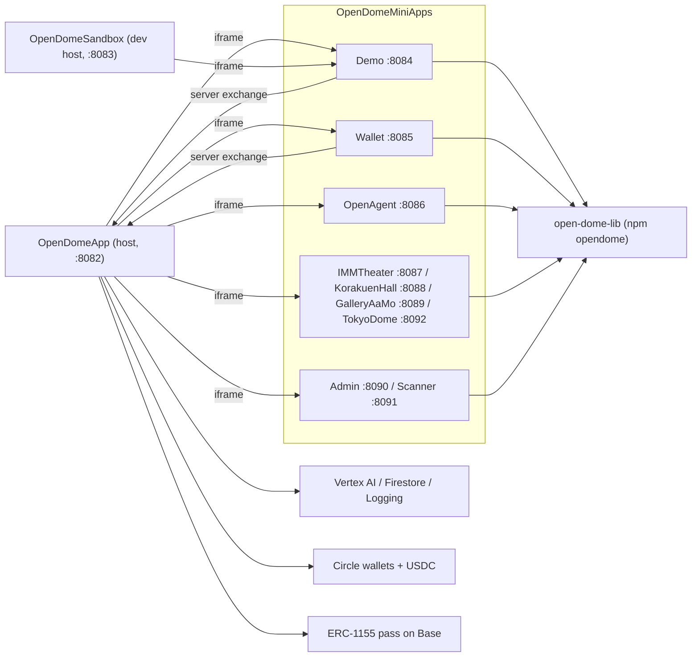
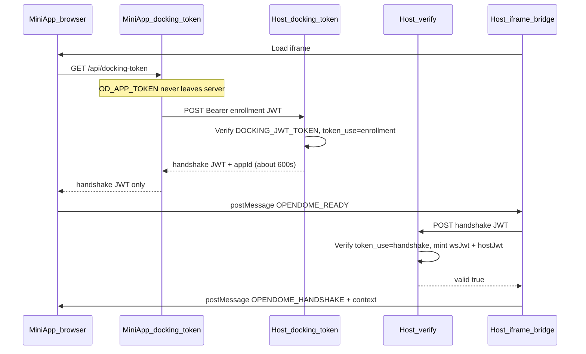
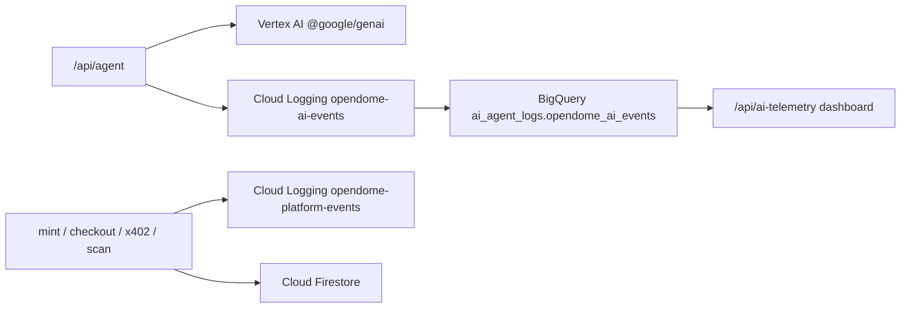
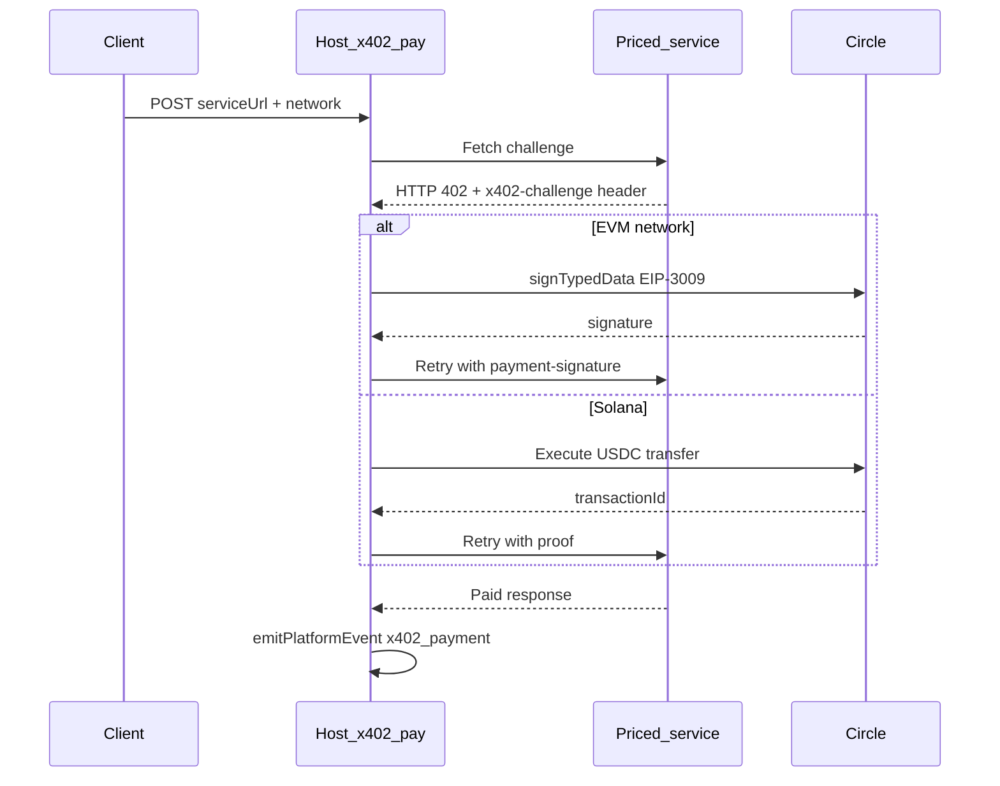

# AGENTS.md — Open-Dome (machine context)

> **Audience: coding agents only.** Humans: `README.md` / `READMEJP.md`.
> Do not rewrite this into marketing prose. Prefer this file over scattered READMEs when changing code.

## Repo identity

- **Name:** Open-Dome (Effisend Labs)
- **Remote:** `Effisend-Labs/Open-Dome` (public)
- **Stack:** Expo 57 / Expo Router, React Native Web, `opendome` SDK (`open-dome-lib`), Vercel server output, Circle developer-controlled wallets, Google Cloud (Vertex AI / Firestore / Logging / BigQuery), MQTT
- **Product shape:** Super-App **host** loads tenant **mini-apps** in iframes; zero-trust docking; USDC settlement per interaction; Gemini agent with tool calling on host
- **Contest framing (do not delete from READMEs):** Build with Gemini XPRIZE — AI-native operations, Google Cloud required, Circle/USDC revenue loop

## Doc map (do not confuse)

| File | For | Purpose |
|------|-----|---------|
| `AGENTS.md` (this) | Agents | Full operational context |
| `README.md` | Humans (EN) | Problem, architecture, GCP + Circle story |
| `READMEJP.md` | Humans (JP) | Same, Japanese |
| Per-app `README.md` | Humans | Run instructions + env for that app |
| Per-app `AGENTS.md` / `CLAUDE.md` | Agents | Expo version pin only (“read Expo v57 docs”) |
| `.agents/AGENTS.md` | Agents | Unrelated UI rule (WhatsApp-style inputs) — not Open-Dome architecture |

Keep README diagrams and this file consistent when changing docking, ports, GCP, or payments.

## System map



## Monorepo layout (authoritative)

```
Open-Dome/
  open-dome-lib/                 # npm name "opendome" — SDK source + dist/
  OpenDome/
    OpenDomeApp/                 # PRODUCTION host
    OpenDomeSandbox/             # DEV / visualizer host
    OpenDomeMiniApps/
      Demo/ Wallet/ OpenAgent/ Admin/ Scanner/
      TokyoDome/ IMMTheater/ KorakuenHall/ GalleryAaMo/
  Contracts/                     # Hardhat ERC-1155 pass
  Landing/                       # Marketing site
```

There is **no** top-level `MiniApp/` folder. Do not invent paths under `./MiniApp/`.

## Local Expo ports (fixed in package.json scripts)

| App | Port | Notes |
|-----|------|--------|
| OpenDomeApp | 8082 | Default docking host (local) |
| OpenDomeSandbox | 8083 | Optional docking target via override |
| Demo | 8084 | |
| Wallet | 8085 | |
| OpenAgent | 8086 | |
| IMMTheater | 8087 | |
| KorakuenHall | 8088 | |
| GalleryAaMo | 8089 | |
| Admin | 8090 | |
| Scanner | 8091 | |
| TokyoDome | 8092 | Was 8086; do not collide with OpenAgent |

Constants also live in `open-dome-lib/src/dockingHost.js` → `LOCAL_EXPO_PORTS`.

## Production URLs

| Role | URL |
|------|-----|
| Host | `https://app.opendome.xyz` |
| Sandbox | `https://opendome.expo.app` |
| Demo | `https://demo.opendome.xyz` |
| Wallet | `https://wallet.opendome.xyz` |
| OpenAgent | `https://agent.opendome.xyz` |
| Admin | `https://admin.opendome.xyz` |
| Scanner | `https://scanner.opendome.xyz` |

Hardcoded prod host default in SDK: `PROD_DOCKING_HOST_URL = https://app.opendome.xyz`.

## Docking protocol (must preserve)



### Key files

| Piece | Path |
|-------|------|
| Host exchange | `OpenDome/OpenDomeApp/src/app/api/docking-token+api.js` (+ Sandbox twin) |
| Host verify | `.../verify+api.js` (App + Sandbox) — uses `process.env.DOCKING_JWT_TOKEN` |
| Mini-app exchange | each mini-app `src/app/api/docking-token+api.js` → `opendome/dist/dockingHost.js` |
| Host URL resolve | `open-dome-lib/src/dockingHost.js` (`resolveDockingHostUrl`, `exchangeDockingEnrollment`) |
| Client handshake | `open-dome-lib/src/useOpenDome.js`, `open-dome-lib/src/docking.js` |

### Host URL waterfall (server-only)

1. `OPENDOME_DOCKING_HOST_URL` if set (escape hatch, e.g. Sandbox `http://localhost:8083`)
2. Else if `VERCEL` / `VERCEL_ENV` → `https://app.opendome.xyz`
3. Else → `http://localhost:8082`

Do **not** reintroduce required per-app host URL env for normal local/prod.

### Crypto / claims

- Algo: HS512
- Shared secret: `DOCKING_JWT_TOKEN` on **App and Sandbox must match** and must be the secret that signed enrollment JWTs
- Enrollment: `token_use=enrollment`, `role=mini_app`, `appId`
- Handshake: `token_use=handshake`, `role=mini_app`, `appId`

### Forbidden (regressions)

- Hardcoded `VALID_TOKENS` arrays in verify routes
- Tracked `sdk/mini-app-credentials.json` or literal docking UUIDs in repo
- `OD_APP_TOKEN` in client bundle / `extra`
- SecretScanner-style hardcoded admin passwords in mini-apps
- Committing `.env`, `creds.log`, or real keys
- Putting test private keys in tracked `open-dome-lib/test/`

## Google Cloud integration (host only)



| Concern | File | Notes |
|---------|------|-------|
| Gemini client | `src/app/api/agent+api.js` | `new GoogleGenAI({ vertexai: true, location: 'global' })`. `location` **must** stay `global`; regional endpoints 404 for these models. Loaded via `nodeRequire` because Metro breaks `google-auth-library`. |
| Tool loop | `src/utilsAPI/geminiToolLoop.js` | `runGeminiWithTools({ ai, model, config, contents, executeTool })` |
| Tool schemas | `open-dome-lib/src/agentSkills.js` | Venue: `search_events`, `get_event`, `list_places`, `list_amenities`, `plan_day`. Wallet: `list_wallets`, `get_wallet`, `get_wallet_token_balance`, `get_wallet_nft_balance`, `list_transactions`, `get_transaction`, `estimate_transfer_fee`, `validate_address`, `create_wallets`, `create_transaction`, `create_solana_pay`, `sign_message`, `get_token` |
| Agent modes | `src/app/api/agent+api.js` | `dome` (venue consultant), `wallet` (Circle tools), `openagent` (plain paid chat) |
| Models / tariff | `open-dome-lib/src/agentTariff.js` | `gemini-3.1-flash-lite`, `gemini-3.6-flash`, `gemini-3.1-pro-preview`; price = base + per-char. Client and host must use the same quote function. |
| Firestore | `src/utilsAPI/passkeyDb.js`, `ticketsDb.js`, `adminUsers.js` | Collections `Users` / `Wallets` / `AdminTickets`, prefixed `Dev*` when `getFirestoreEnv() === 'dev'` (`FIRESTORE_ENV`, else `VERCEL*` → prod) |
| AI telemetry | `src/utilsAPI/aiTelemetry.js` | Log `opendome-ai-events`; `sanitizeUserInput` strips emails/addresses; payload has intent, confidence, model, latency, network |
| Platform telemetry | `src/utilsAPI/platformTelemetry.js` | Log `opendome-platform-events`; `EVENT_TYPES` = `user_created`, `pass_minted`, `usdc_transfer`, `checkout`, `x402_payment`, `gate_scan` |
| Credentials | both telemetry files + `agent+api.js` | `ensureGcpCredentials()` materializes a service-account JSON in `os.tmpdir()` from `GCP_*` env and sets `GOOGLE_APPLICATION_CREDENTIALS`. Never log its contents. |

When adding a telemetry event, extend `EVENT_TYPES` (unknown types are coerced to `unknown`) and keep the BigQuery schema stable.

## Circle / USDC / x402



| Concern | File | Notes |
|---------|------|-------|
| Circle client | `src/utilsAPI/circleTools.js` | `initiateDeveloperControlledWalletsClient({ apiKey: CIRCLE_API_KEY, entitySecret: CIRCLE_ENTITY_SECRET })`. Package name is split (`'@circle-fin/' + '...'`) so Metro cannot bundle it — keep that pattern. |
| Wallet sets / creation | `circleTools.js` | `getOrCreateWalletSet`, `createCircleAgentWallet` (EOA, `idempotencyKey`) |
| Agent tool runtime | `src/utilsAPI/circleAgentRuntime.js` | `runCircleAgentTool(name, args, ctx)`, `buildWalletAgentContext`, `fetchBalancesForUserWallets`. Circle rejects `blockchain` when `walletIds` is set. |
| x402 buyer | `src/app/api/x402-pay+api.js` | `x402Version: 2`; expects `x402-challenge` header; Solana path settles first then proves |
| x402 primitives | `open-dome-lib/src/x402Challenge.js`, `eip3009.js`, `usdcChains.js` | `X402_PAYMENT_CHAIN_KEYS` = `BASE`, `ARB`, `OP`, `MATIC`, `AVAX`, `SOL` |
| Sponsored transfers | `src/utilsAPI/sponsorUsdcTransfer.js`, `sponsorSolanaTransfer.js` | Merchant pays fees |
| CCTP bridge | `src/utilsAPI/cctp/*` | EVM → Solana USDC when treasury and payment network differ |
| Mint after payment | `opendome/dist/platformMint.js`, `/api/mint`, `/api/checkout` | ERC-1155 pass on Base (`CONTRACT_ADDRESS`) |

Guest approval is mandatory before any settlement. Do not add auto-pay paths.

## Env matrices

### Host (OpenDomeApp / OpenDomeSandbox)

Examples: `OpenDome/OpenDomeApp/.env.example`, `OpenDome/OpenDomeSandbox/.env.example`.

Required shape (names only): `SESSION_JWT_TOKEN`, `MQTT_JWT_TOKEN`, `DOCKING_JWT_TOKEN`, `ADMIN_SERVICE_TOKEN`, `GCP_PROJECT_ID`, `GCP_CLIENT_EMAIL`, `GCP_PRIVATE_KEY`, `CIRCLE_API_KEY`, `CIRCLE_ENTITY_SECRET`, `CONTRACT_ADDRESS`, `MERCHANT_ADDRESS`, `MERCHANT_PRIVATE_KEY`, `MERCHANT_SOLANA_ADDRESS`, `MERCHANT_SOLANA_PRIVATE_KEY`.
App-only: `CRON_SECRET`. Optional: `FIRESTORE_ENV`, `RPC_URL_*`, `*_MINIAPP_URL`.

### Mini-app

```
EXPO_PUBLIC_OD_SKIP_AUTH=false   # debug only if true
EXPO_PUBLIC_OD_APP_ID=...
OD_APP_TOKEN=...                 # required
# OPENDOME_DOCKING_HOST_URL=     # optional override only
```

## SDK (`opendome`)

- Source: `open-dome-lib/src/`
- Build: `npm run build` → `dist/` (Babel). Hosts and mini-app API routes import `opendome/dist/<module>.js` for Vercel.
- Consumer apps: `"opendome": "file:../../../open-dome-lib"`
- Entry hook: `useOpenDome` — after auth exposes `blockchain`, location, Communication/Events, Host bridge helpers
- MQTT realtime = `Communication` (not the old Events name for the broker)
- Venue catalog queries = `Events` (JSON helpers over `src/dbs/events.json`)
- Day planner council = deterministic, no Gemini (`dayPlannerAgents.js`, `amenityAffinity.js`, `itinerary.js`, `planner.js`)
- Host Gemini + x402 = `OpenDomeApp` `/api/agent` (and Sandbox twin)

## Host responsibilities vs mini-apps

| Concern | Host | Mini-app |
|---------|------|----------|
| Passkey / roles | yes | no |
| Docking verify / enroll exchange | yes | exchange only |
| Circle / merchant / GCP | yes | no |
| Mint / checkout / agent | yes | may call Host bridge |
| UI for venue / wallet / agent chat | no | yes |

Admin / Scanner are thin UIs; secrets stay on App. Bridge actions: `Host.*` → host APIs (`runHostRequest`).

## Deploy order

1. Deploy host code + host env (`DOCKING_JWT_TOKEN` aligned across App and Sandbox)
2. Deploy mini-apps with matching enrollment `OD_APP_TOKEN`s
3. Never point Vercel mini-app `OPENDOME_DOCKING_HOST_URL` at localhost

## Vercel monorepo builds (CPU / cost)

Each app’s `vercel.json` sets `ignoreCommand` to:

```text
node <rel>/scripts/vercel-ignore.cjs . <rel>/open-dome-lib
```

(`Landing` only watches `.`.)

Behavior (exit `0` = skip, `1` = build):

- Builds only when that app folder **or** `open-dome-lib` changed vs `VERCEL_GIT_PREVIOUS_SHA` (fallback `HEAD^`)
- README / AGENTS / unrelated apps do **not** trigger a rebuild
- Changing `open-dome-lib` correctly rebuilds every consumer that depends on it

Script: [`scripts/vercel-ignore.cjs`](./scripts/vercel-ignore.cjs).  
Do not set Project Settings → Ignored Build Step to “Automatic”; `ignoreCommand` in `vercel.json` overrides it when present. Keep Root Directory = the app folder (e.g. `OpenDome/OpenDomeApp`).

## Engineering constraints (this repo)

- Modular by domain; no god files mixing route + business + DB when avoidable
- Expo API routes: `src/app/api/*+api.js`
- Web output: server (`vercel.json` → Expo adapter)
- Node-only SDKs (Firestore, Circle, `@google/genai`) load through `src/utilsAPI/nodeRequire.js`; do not convert to static imports
- Credential hygiene: gitignore `.env`; scan before commit; never echo secrets in chat/logs
- After `open-dome-lib` src changes: rebuild `dist/` before expecting host/mini-app imports to change

## Common agent tasks → where to edit

| Task | Start here |
|------|------------|
| Change docking crypto / host resolve | `open-dome-lib/src/dockingHost.js`, host `docking-token+api.js` / `verify+api.js`, rebuild dist |
| New mini-app | Copy Demo docking route; assign next free port; add store entry in App `apps+api.js` |
| CORS / origins | Host `verify+api.js` allows any localhost; prod `*.opendome.xyz` |
| Pass / mint | `opendome/dist/platformMint.js`, App mint/checkout APIs |
| Agent tariff | `open-dome-lib/src/agentTariff.js` + OpenAgent UI + host agent route |
| New Gemini tool | `open-dome-lib/src/agentSkills.js` (schema) + executor in `circleAgentRuntime.js` or dome skills, rebuild dist |
| New telemetry metric | `aiTelemetry.js` / `platformTelemetry.js`, then dashboard route `ai-telemetry+api.js` |

## Explicit non-goals unless user asks

- Git history purge of old leaked blobs
- Rotating provider keys in Circle/GCP dashboards
- Rewriting human README into this file (or vice versa)
