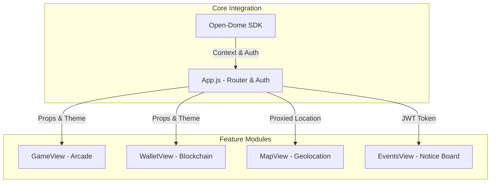
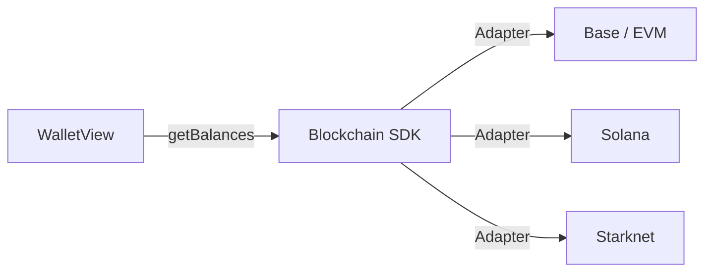
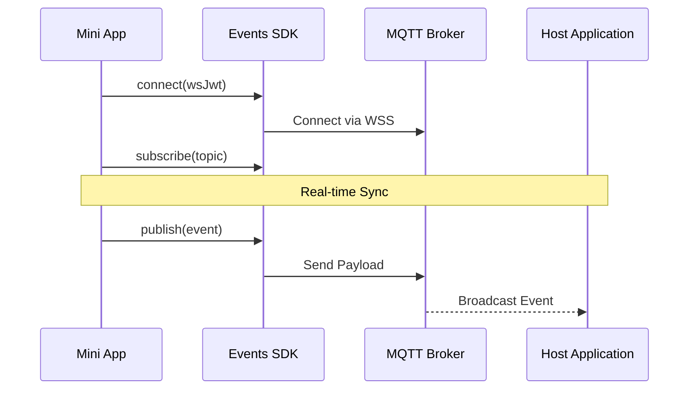
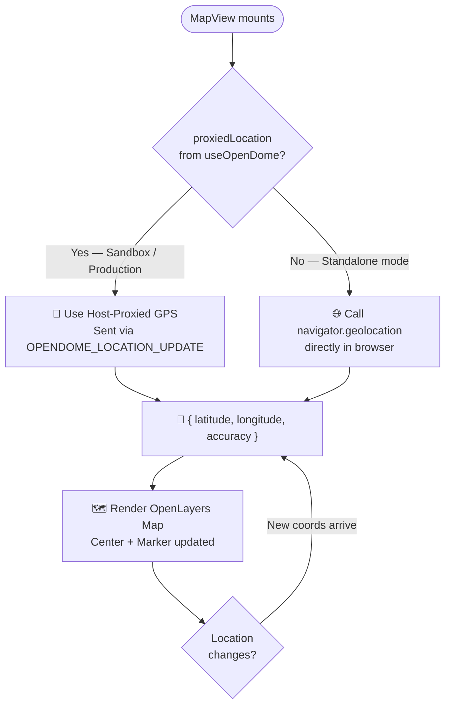

# 📱 Open-Dome Mini App Example

The **Open-Dome Mini App Example** is a production-ready reference implementation built with React Native and Expo. It demonstrates how to leverage the full suite of Open-Dome SDK features to create a secure, blockchain-enabled modular application.

## 🚀 Live Demo
See the Mini App in action within the Visualizer: **[https://miniapp.expo.app](https://miniapp.expo.app)**
*(Note: This link works best when loaded via the [Open-Dome Sandbox](https://opendome.expo.app/))*

---

## 🛠️ Implementation Architecture

The Mini App is designed as a collection of specialized views, all synchronized through the Open-Dome SDK.

### 1. Blockchain & Wallet
The **Wallet** implementation provides a unified view of assets across multiple chains. It utilizes the SDK's adapter system to abstract away chain-specific complexities.

**Key File:** [WalletView.js](file:///c:/Users/VAI/Github/Open-Dome/MiniApp/src/components/WalletView.js)

---

### 2. Real-Time Notice Board
The **Events** module demonstrates bi-directional communication using MQTT over WebSockets.

**Key File:** [EventsView.js](file:///c:/Users/VAI/Github/Open-Dome/MiniApp/src/components/EventsView.js)

---

### 3. Geolocation & Interactive Maps
The **Map** module renders an interactive map using OpenLayers. It implements a **dual-source GPS strategy** — it prioritises the location proxied from the Host (as the production Super-App would provide it) and falls back to direct browser `navigator.geolocation` when running standalone.

**Key behaviours:**
- When running inside the **Sandbox**, the Sandbox's browser acquires GPS and streams it into the iframe via `postMessage(OPENDOME_LOCATION_UPDATE)`. The Mini App never requests permissions.
- When running **standalone** (e.g. `npx expo start --web`), the Mini App requests `navigator.geolocation` directly from the user's browser.
- The map re-centers and moves the marker on every coordinate update in real-time.

**Key File:** [MapView.js](file:///c:/Users/VAI/Github/Open-Dome/MiniApp/src/components/MapView.js)

---

## 🏗️ Project Structure

- **`src/App.js`**: Handles the `useOpenDome` handshake and provides the global theme context.
- **`src/components/`**: Contains the functional modules (Game, Wallet, Map, Events).
- **`src/theme.js`**: Cyberpunk design system that adapts to `light`/`dark` modes from the Host.

---

MIT © Effisend Labs
