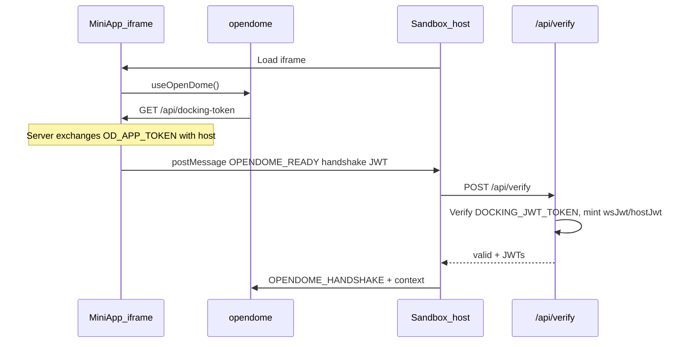

# Open-Dome Sandbox (Visualizer)

Dev host that mirrors production docking so you can test mini-apps in an iframe before shipping.

**Live:** [sandbox.opendome.xyz](https://sandbox.opendome.xyz) · **Local:** `npm run web` → `http://localhost:8083`

Production host is [app.opendome.xyz](https://app.opendome.xyz) (`OpenDomeApp`, port `8082`).

---

## Handshake



Enrollment stays on the mini-app server. Sandbox verifies the short-lived handshake JWT with the same `DOCKING_JWT_TOKEN` as OpenDomeApp.

To point a local mini-app at Sandbox instead of App:

```bash
OPENDOME_DOCKING_HOST_URL=http://localhost:8083
```

Otherwise docking auto-resolves to App (`:8082` local / `https://app.opendome.xyz` on Vercel).

---

## Host bridge

Sandbox relays `OPENDOME_HOST_REQUEST` to same-origin APIs (`scan`, `transfer`, `nfts`, `users`, `assign`, `mint`, …).  
Mint: god JWT or `ADMIN_SERVICE_TOKEN`.

Host secrets: see [`.env.example`](./.env.example).  
Mini-apps need only `OD_APP_TOKEN` (+ optional `EXPO_PUBLIC_OD_APP_ID` / skip-auth).

### Context & GPS

Inject theme / username / lang from the control panel. Browser geolocation is proxied into the iframe so mini-apps do not need device permission in the host model.

### Event board

Bottom MQTT log for cross-app traffic (uses `hostJwt` after a successful handshake).

---

## Local

```bash
cd OpenDome/OpenDomeSandbox
npm install
npm run web   # :8083
```

Copy `.env.example` → `.env` and share `DOCKING_JWT_TOKEN` with OpenDomeApp.

---

## Vertex agent note

`/api/agent` needs `GCP_*` and Vertex `location: 'global'` for the provisioned Gemini models.

---

MIT © Effisend Labs
