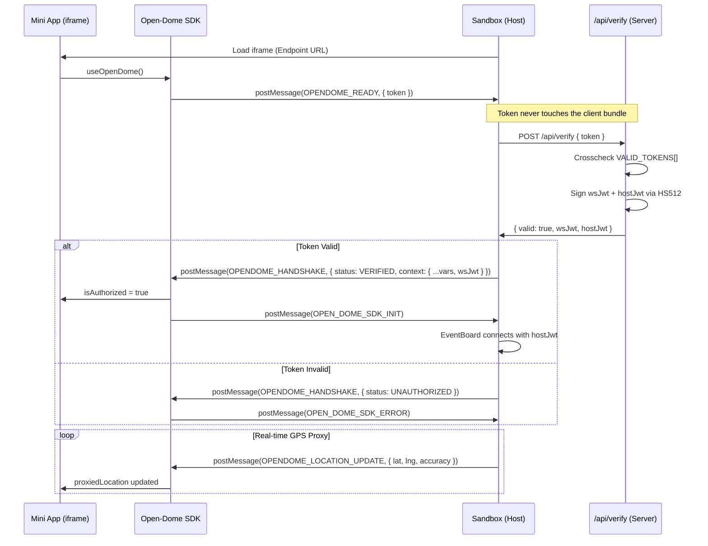
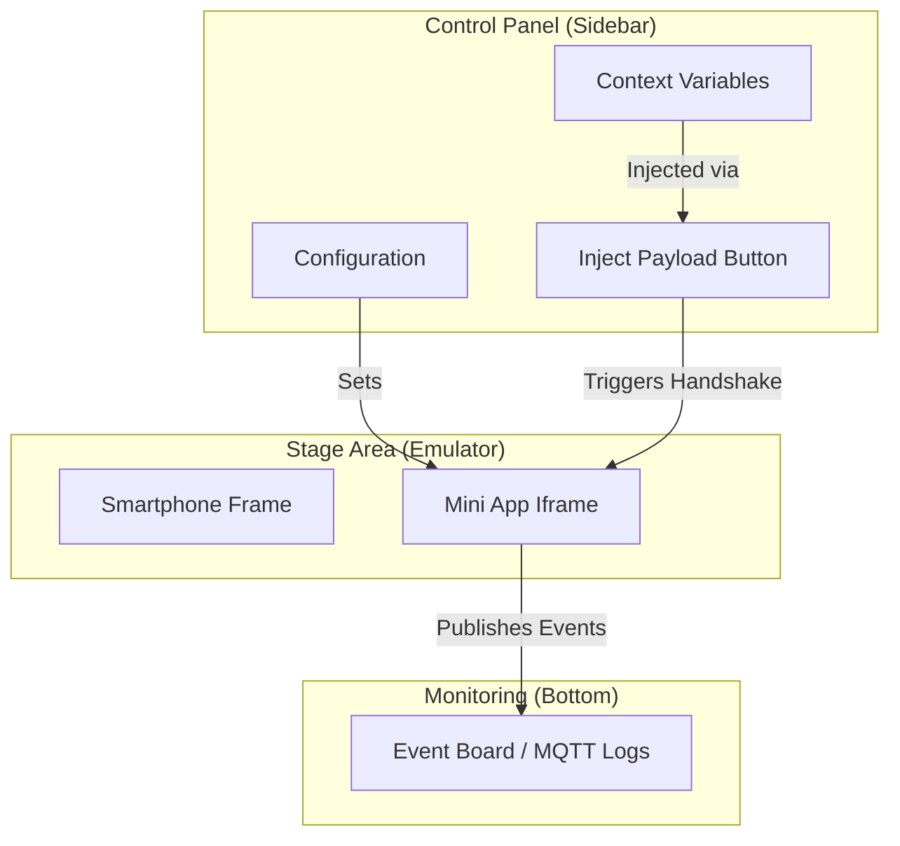

# 🧪 Open-Dome Sandbox (Visualizer)

The **Open-Dome Sandbox**, also known as the **Visualizer**, is the professional-grade environment for testing and verifying Open-Dome Mini Apps. It acts as the "Host" application, providing the necessary security infrastructure and context for Mini Apps to function.

## 🚀 Live Demo
Access the live Sandbox here: **[https://opendome.expo.app/](https://opendome.expo.app/)**

---

## 🧐 How it Works

The Sandbox replicates the production environment of the Effisend Super-App by creating a secure bridge with your Mini App.

### 1. The Handshake & Communication Flow
The Sandbox is the **authority** in the ecosystem. It receives the Mini App's identity token, verifies it server-side, issues signed JWTs, and then injects the full context.

### 2. Sandbox Feature Architecture
The Sandbox provides a multi-layered testing interface.

---

## 🛠️ Testing & Configuration

### Context Injection
Modify the **Context Variables** to test how your app reacts to different environments:
- **Theming**: Switch between `light` and `dark`.
- **User Metadata**: Change `username` or `lang`.
- **Security**: Test with valid or invalid tokens to verify error handling.

### Location Proxying
The Sandbox captures the browser's geolocation and proxies it to the Mini App, mimicking the production security model where Mini Apps don't have direct hardware access.

### Event Monitoring
The **Event Board** at the bottom monitors all MQTT traffic. When your Mini App publishes an event, it will appear here in real-time, allowing you to debug cross-app communication.

---

MIT © Effisend Labs
