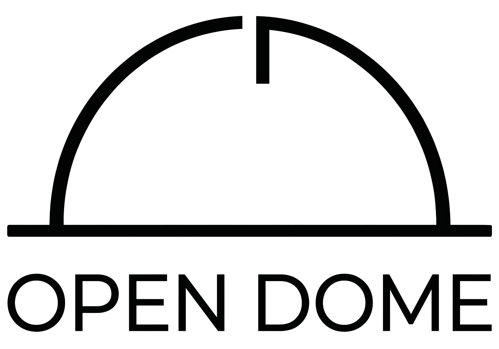
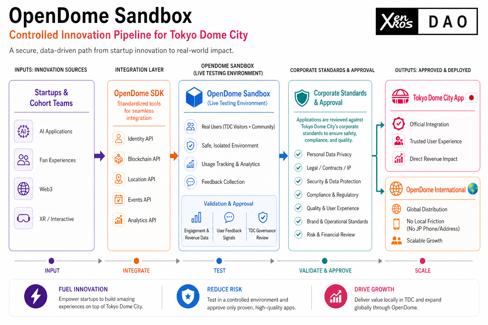
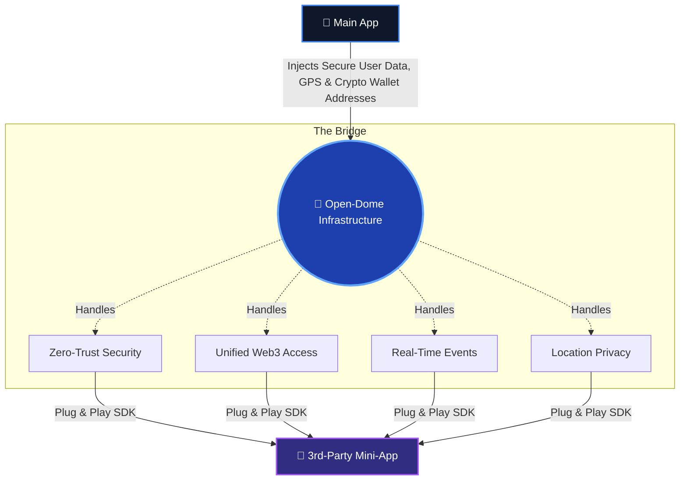

# 🏟️ Open-Dome
### *The Infrastructure Layer for the Super-App Era*

  

> Built for **Tokyo Dome City**. Designed to scale globally.

---

## The Market Problem

The "Super-App" is the future of mobile experience. Platforms want to host multiple modular "Mini Apps" inside their main application to keep users engaged. But building this architecture is **expensive, slow, and insecure**. 

Every development team wastes months reinventing the same infrastructure:
* *How do we securely log a user into a third-party mini-app without exposing their password?*
* *How do we manage 5 different blockchain networks without rewriting our codebase?*
* *How do we safely share the user's location without triggering invasive phone privacy warnings?*

**Open-Dome solves this.** We provide the underlying plumbing so companies can build, scale, and secure Super-App ecosystems instantly.

---

## The Vision

Imagine **Tokyo Dome City** — a massive, self-contained entertainment complex in the heart of Tokyo. It's not just a stadium; it's a city with hotels, amusement parks, concert halls, restaurants, and shops.

Now, imagine a **single mobile app** that lets you experience it all without ever leaving the ecosystem. That's the vision of a **Super-App**, and **Open-Dome** is the invisible infrastructure that makes it possible.

## What is Open-Dome?

Open-Dome is a **plug-and-play, enterprise-grade infrastructure suite**. It provides the secure bridge, the multi-chain Web3 adapter, and the real-time communication network that powers next-generation Super-Apps.

It is not a simple UI library. It is the core operational engine that cuts developer integration time from months to minutes.

---

## The Value Proposition

We translate complex technical hurdles into seamless business operations.

| Enterprise Advantage | The Problem We Solve | How Open-Dome Delivers It |
| --- | --- | --- |
| **Zero Trust Security** | App-to-app logins are vulnerable to data leaks. | **Zero-trust architecture.** The Host app verifies all users server-side before injecting credentials. |
| **Unified Web3 Access** | Supporting multiple blockchains is a technical nightmare. | **One unified API.** We seamlessly route across Ethereum, Solana, and Starknet with zero extra code. |
| **Real-Time Data** | Live events require lightning-fast data syncing. | **Live Event Bus.** A dedicated, secure channel for instant messaging between apps. |
| **Privacy by Default** | Mini-apps trigger scary iOS/Android permissions. | **Hardware Proxying.** The Host safely passes GPS data to the mini-app. No direct permissions needed. |

---

## The Three Pillars of the Ecosystem

### 1. 🔌 The Engine: Open-Dome SDK

*Months of infrastructure engineering, reduced to a single line of code.*

Developers drop our lightweight SDK into their Mini App. Behind the scenes, it automatically handles the complex security handshakes, blockchain connections, and live event streaming. Developers can focus purely on building a great user experience, while we handle the pipes.

### 2. 🧪 The Proving Ground: Open-Dome Sandbox

*Test before you ship.*

We provide a professional-grade testing laboratory. Development teams can load their Mini App into our Sandbox to simulate exactly how it will perform inside a massive Super-App. They can test security injections, user profiles, and real-time GPS tracking safely before deploying to millions of real users.

### 3. 📱 The Blueprint: Example Mini App

*A production-ready starting line.*

To accelerate adoption, we built a fully functional reference app. It proves our technology works on day one, featuring a multi-chain crypto wallet, a live map using proxied GPS, and an interactive game powered by our real-time network. Companies can fork this blueprint and have a working app by the afternoon.

---

## The Business Case: Why Open-Dome Wins

* **Drastic Cost Reduction:** By standardizing the communication between Host apps and Mini Apps, we eliminate the need for expensive, custom security engineering for every new partnership.
* **Total Data Control:** Our architecture guarantees that the Host Super-App remains the absolute authority. Third-party Mini Apps only see exactly what the Host allows them to see.
* **Developer Adoption Engine:** Open-Dome is open-source. By making it free and incredibly easy for developers to use, we are building a massive funnel for ecosystem adoption, setting the standard for how Super-Apps operate.
* **Future-Proof:** Whether a company is building traditional Web2 experiences or launching Web3 decentralized networks, Open-Dome natively supports both out of the box.

---

## See It Live

Experience the technology firsthand. Load the **Example Mini App** into the **Sandbox**, click *Inject Payload*, and watch the secure handshake, live data streaming, and multi-chain wallet in real-time.

| Resource | Access Link |
| --- | --- |
| 🏟️ **The Sandbox (Host Environment)** | [opendome.expo.app](https://opendome.expo.app/) |
| 📱 **Example Mini App** | [miniapp.expo.app](https://miniapp.expo.app) |

> ⚠️ **Note:** The **Example Mini App** can only be accessed and run through the **Sandbox**. The Open-Dome SDK requires a secure, active connection between the sandbox host environment and the mini app to function correctly.

---

*Open-Dome — Built by Effisend Labs*