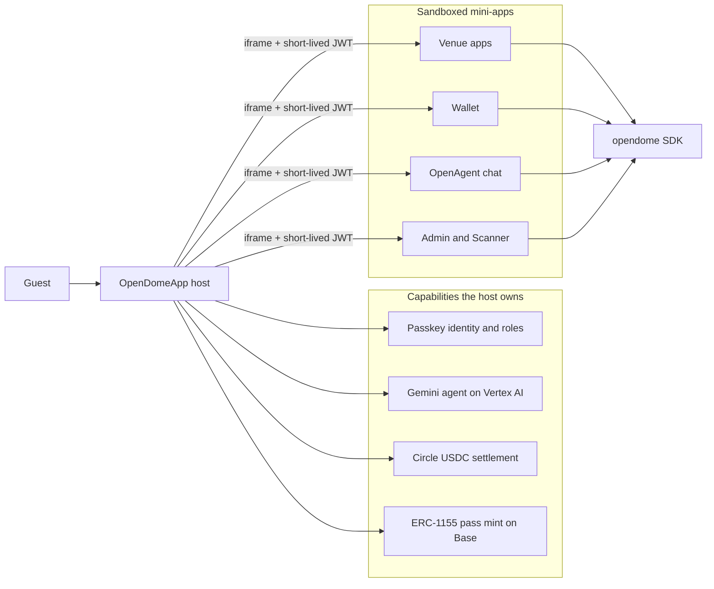
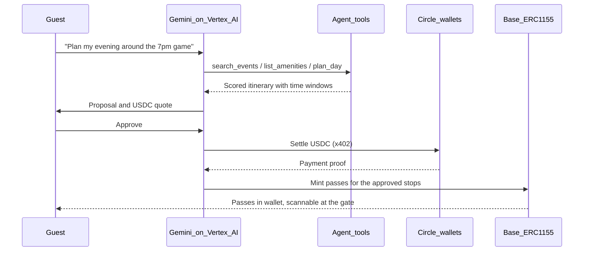
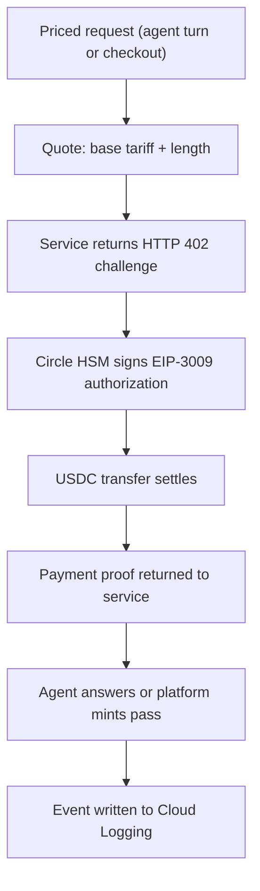
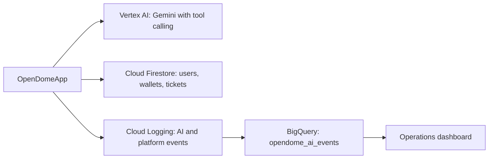
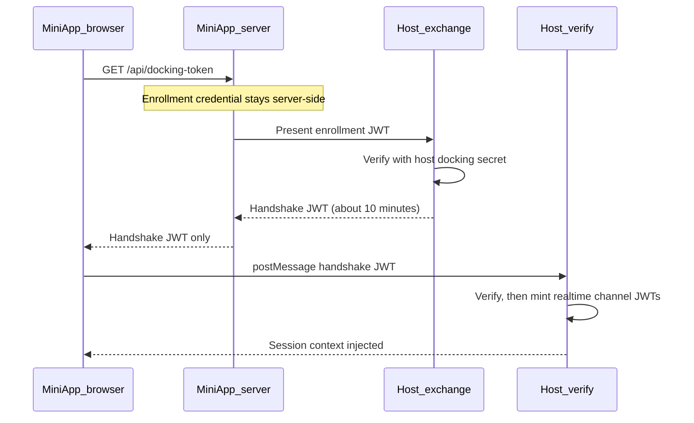

# Open-Dome

### Agent-operated infrastructure for venue super-apps

<p align="center">
  
</p>

> Built for **Tokyo Dome City**. Designed for any venue that sells access, experiences, and time.

日本語: [`READMEJP.md`](./READMEJP.md) · Machine context for coding agents: [`AGENTS.md`](./AGENTS.md)

---

## The problem

A venue like Tokyo Dome City is a small economy: a stadium, concert halls, an amusement park, hotels, galleries, restaurants. Each tenant wants its own app experience. The venue wants one relationship with the guest.

Building that as a super-app breaks on three hard problems:

| Problem | Why it blocks the business |
| --- | --- |
| **Tenant apps cannot be trusted** | A third-party mini-app inside your app can read sessions, tokens, and location if the boundary is weak. |
| **Money does not move per interaction** | Card rails cannot economically settle a $0.001 agent answer or a single pass. Everything gets bundled into slow, manual invoicing. |
| **Operations need people at every step** | Planning a guest's day, quoting it, charging it, and issuing the pass is human labor per guest. |

Open-Dome solves all three: a zero-trust docking protocol for tenant mini-apps, USDC settlement per interaction through Circle, and a Gemini agent that runs the plan-quote-charge-fulfill loop in production.

---

## What Open-Dome is

A production monorepo with three parts:

- **Host app** (`OpenDomeApp`) — the guest-facing super-app. Owns identity, payments, minting, and the agent. All secrets live here.
- **Mini-apps** — tenant and staff surfaces (venues, wallet, agent chat, admin, gate scanner) loaded in sandboxed iframes.
- **SDK** (`opendome`) — the library a tenant installs to dock into the host and get session, wallet, realtime, and location capabilities.


```mermaid
flowchart LR
  Guest["Guest"] --> Host["OpenDomeApp host"]

  subgraph platform [Capabilities the host owns]
    Auth["Passkey identity and roles"]
    Agent["Gemini agent on Vertex AI"]
    Pay["Circle USDC settlement"]
    Mint["ERC-1155 pass mint on Base"]
  end

  Host --> Auth
  Host --> Agent
  Host --> Pay
  Host --> Mint

  subgraph tenants [Sandboxed mini-apps]
    Venue["Venue apps"]
    Wallet["Wallet"]
    OpenAgent["OpenAgent chat"]
    Staff["Admin and Scanner"]
  end

  Host -->|"iframe + short-lived JWT"| Venue
  Host -->|"iframe + short-lived JWT"| Wallet
  Host -->|"iframe + short-lived JWT"| OpenAgent
  Host -->|"iframe + short-lived JWT"| Staff

  Venue --> SDK["opendome SDK"]
  Wallet --> SDK
  OpenAgent --> SDK
  Staff --> SDK
```

---

## AI-native operations

The agent is not a chat widget bolted onto a catalog. It executes the revenue loop: it decides what to propose, prices it, triggers settlement, and the platform fulfills.


```mermaid
sequenceDiagram
  participant Guest
  participant Agent as Gemini_on_Vertex_AI
  participant Tools as Agent_tools
  participant Circle as Circle_wallets
  participant Chain as Base_ERC1155

  Guest->>Agent: "Plan my evening around the 7pm game"
  Agent->>Tools: search_events / list_amenities / plan_day
  Tools-->>Agent: Scored itinerary with time windows
  Agent->>Guest: Proposal and USDC quote
  Guest->>Agent: Approve
  Agent->>Circle: Settle USDC (x402)
  Circle-->>Agent: Payment proof
  Agent->>Chain: Mint passes for the approved stops
  Chain-->>Guest: Passes in wallet, scannable at the gate
```

**What the AI decides:** which events match intent, which amenities fit each time slot, the schedule under travel and opening-hour constraints, the price of each answer, and which tools to call to inspect wallets and move funds.

**What humans decide:** they approve payment. Nothing auto-charges a guest.

Two agent layers run in production:

| Layer | Model / method | Role |
| --- | --- | --- |
| **Day-planner council** | Deterministic multi-agent scoring in the SDK | Scout, schedule, and critique itineraries with no LLM cost or nondeterminism |
| **Host agent** | Gemini on Vertex AI with tool calling | Free-form guest requests, wallet operations, venue consulting |

The council proposes; Gemini negotiates, explains, and executes tools. Splitting them keeps itinerary quality reproducible and keeps LLM spend tied to actual paid turns.

---

## Payments: Circle wallets, USDC, and x402

Every priced interaction settles in USDC. There is no invoicing step and no card terminal.


```mermaid
flowchart TD
  Request["Priced request (agent turn or checkout)"] --> Quote["Quote: base tariff + length"]
  Quote --> Challenge["Service returns HTTP 402 challenge"]
  Challenge --> Sign["Circle HSM signs EIP-3009 authorization"]
  Sign --> Settle["USDC transfer settles"]
  Settle --> Proof["Payment proof returned to service"]
  Proof --> Fulfill["Agent answers or platform mints pass"]
  Fulfill --> Log["Event written to Cloud Logging"]
```

| Capability | How it works |
| --- | --- |
| **Programmable wallets** | Circle developer-controlled wallets, created per user in wallet sets. Keys never touch the client. |
| **Gasless authorization** | Circle signs EIP-3009 typed data, so the guest authorizes a USDC transfer without holding gas. |
| **x402 metering** | Each agent turn is priced as base tariff plus character length, challenged over HTTP 402, then settled before the model runs. |
| **Multi-network** | Base, Arbitrum, Optimism, Polygon, Avalanche, and Solana USDC. Solana settles through Circle then proves payment. |
| **Cross-chain** | CCTP moves USDC from EVM to Solana when the guest pays on a different network than the treasury holds. |
| **Agent-callable** | Gemini can call wallet tools directly: `list_wallets`, `get_wallet_token_balance`, `estimate_transfer_fee`, `create_transaction`, `create_solana_pay`, `sign_message`. |

Because settlement is per interaction, the unit economics are visible per guest, per turn, and per pass rather than at month end.

---

## Google Cloud footprint

Google Cloud runs inference, state, and the evidence trail that proves the AI is operating live.


```mermaid
flowchart LR
  Host["OpenDomeApp"] --> Vertex["Vertex AI: Gemini with tool calling"]
  Host --> Firestore["Cloud Firestore: users, wallets, tickets"]
  Host --> Logging["Cloud Logging: AI and platform events"]
  Logging --> BigQuery["BigQuery: opendome_ai_events"]
  BigQuery --> Dashboard["Operations dashboard"]
```

| Service | Use |
| --- | --- |
| **Vertex AI** (`@google/genai`) | Gemini 3.1 Flash-Lite, Gemini 3.6 Flash, and Gemini 3.1 Pro for guest chat, venue consulting, and wallet tool calling. |
| **Cloud Firestore** | Guest identity and roles, Circle wallet references, issued passes and gate tickets, with separate dev and production namespaces. |
| **Cloud Logging** | Two structured streams: `opendome-ai-events` (intent, model, latency, payment network) and `opendome-platform-events` (mints, transfers, checkouts, x402 payments, gate scans). |
| **BigQuery** | Log sink into `ai_agent_logs.opendome_ai_events`, giving a queryable record of every agent decision and settlement for the operations dashboard. |

Guest input is sanitized before logging: emails and wallet addresses are stripped, so the operational record stays useful without retaining personal data.

---

## Zero-trust docking

A tenant mini-app must prove its identity to the host. The host never trusts iframe content, and the tenant's long-lived credential never reaches a browser.


```mermaid
sequenceDiagram
  participant Browser as MiniApp_browser
  participant MiniServer as MiniApp_server
  participant HostAPI as Host_exchange
  participant Verify as Host_verify

  Browser->>MiniServer: GET /api/docking-token
  Note over MiniServer: Enrollment credential stays server-side
  MiniServer->>HostAPI: Present enrollment JWT
  HostAPI->>HostAPI: Verify with host docking secret
  HostAPI-->>MiniServer: Handshake JWT (about 10 minutes)
  MiniServer-->>Browser: Handshake JWT only
  Browser->>Verify: postMessage handshake JWT
  Verify->>Verify: Verify, then mint realtime channel JWTs
  Verify-->>Browser: Session context injected
```

Consequences that matter commercially: a leaked browser token expires in minutes, a compromised tenant cannot impersonate another tenant, and a tenant can be revoked by rotating one host secret. Location is proxied by the host, so tenants get geolocation without triggering their own device permission prompts.

---

## The ecosystem

| Surface | Role | Live |
| --- | --- | --- |
| **OpenDomeApp** | Production host: identity, store, payments, agent, minting | [app.opendome.xyz](https://app.opendome.xyz/) |
| **OpenDomeSandbox** | Host emulator for tenant developers | [opendome.expo.app](https://opendome.expo.app/) |
| **Demo** | Reference guest guide mini-app | [demo.opendome.xyz](https://demo.opendome.xyz/) |
| **Wallet** | USDC and pass wallet | [wallet.opendome.xyz](https://wallet.opendome.xyz/) |
| **OpenAgent** | Pay-per-prompt Gemini chat | [agent.opendome.xyz](https://agent.opendome.xyz/) |
| **Admin** | Staff issuing and fulfillment | [admin.opendome.xyz](https://admin.opendome.xyz/) |
| **Scanner** | Gate verification | [scanner.opendome.xyz](https://scanner.opendome.xyz/) |
| **Venue apps** | Tokyo Dome, IMM Theater, Korakuen Hall, Gallery AaMo | In-host |

Mini-apps run inside a host iframe by design. Opening one directly leaves it locked, because it has no verified session.

---

## Run it locally

```bash
# 1. Host (owns secrets, verifies docking)
cd OpenDome/OpenDomeApp && npm install && npm run web    # http://localhost:8082

# 2. A mini-app
cd OpenDome/OpenDomeMiniApps/Demo && npm install && npm run web   # http://localhost:8084
```

Open the mini-app from the host store so docking can complete. The docking host resolves automatically: `localhost:8082` in development, `app.opendome.xyz` in production. Copy `.env.example` in each app and keep real secrets out of git.

Full port map, environment matrix, and protocol rules: [`AGENTS.md`](./AGENTS.md).

---

## Built for the agent economy

Open-Dome is our entry for **[Build with Gemini XPRIZE](https://xprize.devpost.com/)**, in the spirit of the *Small Business Services* and *Entrepreneurship & Job Creation* categories: the venue and its tenants get an operation that runs on AI instead of headcount.

- The business loop (plan, quote, charge, fulfill, verify at the gate) is executed by agents in production, not simulated in a demo.
- Google Cloud is load-bearing: Vertex AI for inference, Firestore for state, Cloud Logging and BigQuery for the evidence trail.
- Circle and USDC make per-interaction revenue viable, which is what lets a tenant onboard without a contract negotiation.
- Every tenant that docks is a new revenue surface that costs the venue no additional engineering.

---

MIT © Effisend Labs


