# Open Dome OS

### Gemini operates the venue. Circle makes every action payable in USDC.

<p align="center">
  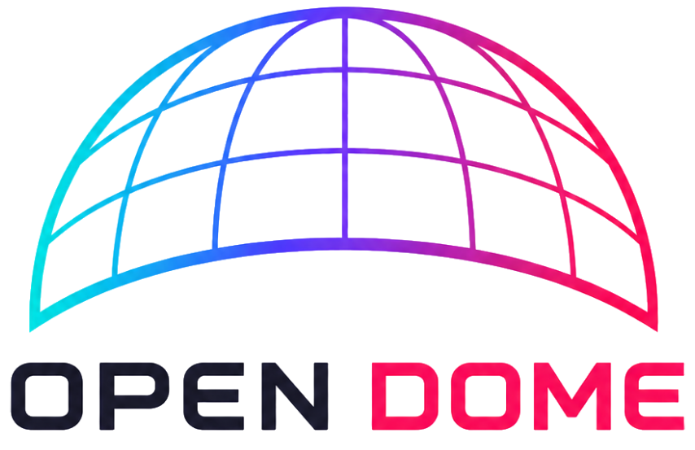
</p>

> Built for **Tokyo Dome City**. Designed for any venue that sells access, experiences, and time.

日本語: [`READMEJP.md`](./READMEJP.md) · Machine context for coding agents: [`AGENTS.md`](./AGENTS.md)

---

## What it is

A venue like Tokyo Dome City is really many businesses: a stadium, concert halls, an amusement park, hotels, galleries, restaurants. Today each one wants its own app, and the guest ends up juggling all of them.

Open-Dome replaces that with **one app the guest keeps, and many small apps that plug into it**. If you have seen mini-apps in Farcaster or the Base App, this is the same idea applied to a physical venue: the venue runs the main app, and any team can build an experience that opens inside it.

The product loop is deliberately simple: **ask → decide → approve → settle → deliver**. Gemini on Google Cloud understands the request and calls the right venue or wallet tools. Circle gives each guest a programmable wallet and settles the approved USDC payment. The answer, transfer, or pass arrives in the same app.

<table>
  <tr>
    <td align="center"><strong>Gemini finds the experience</strong><br><sub>Live venue data through agent tools</sub><br>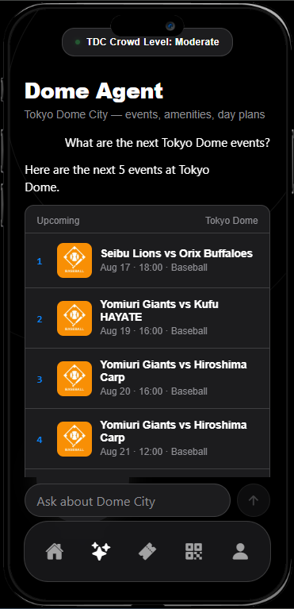</td>
    <td align="center"><strong>The guest approves USDC</strong><br><sub>Amount, model, network, and tariff stay visible</sub><br>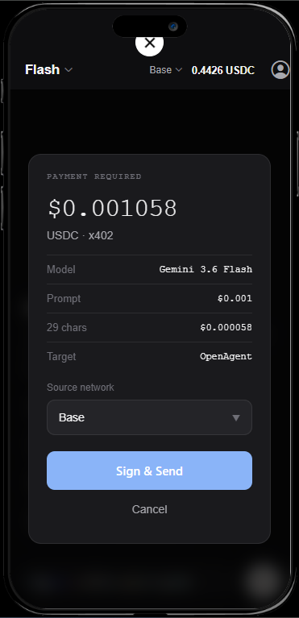</td>
    <td align="center"><strong>Circle makes funds usable</strong><br><sub>Balances across supported networks in one conversation</sub><br>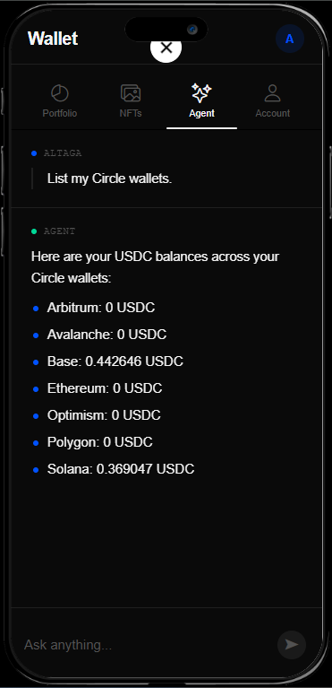</td>
  </tr>
</table>

Three pieces, nothing more:

| Piece | Who uses it | Plain description |
| --- | --- | --- |
| **App** ([app.opendome.xyz](https://app.opendome.xyz)) | Guests only | The real OpenDome host. Login, wallet, money, AI agent, and live mini-apps. Guests never open Sandbox. |
| **Sandbox** ([sandbox.opendome.xyz](https://sandbox.opendome.xyz)) | Developers only | A test host that behaves like App. Use it to try your mini-app. Do not treat it as the product guests use. |
| **Mini-apps** | Built by developers | Your own web apps. You build these. You never change App or Sandbox to ship a feature. |
| **SDK** (`opendome`) | Developers only | One package to dock into App or Sandbox and use identity, wallet, location, events, and payments. |

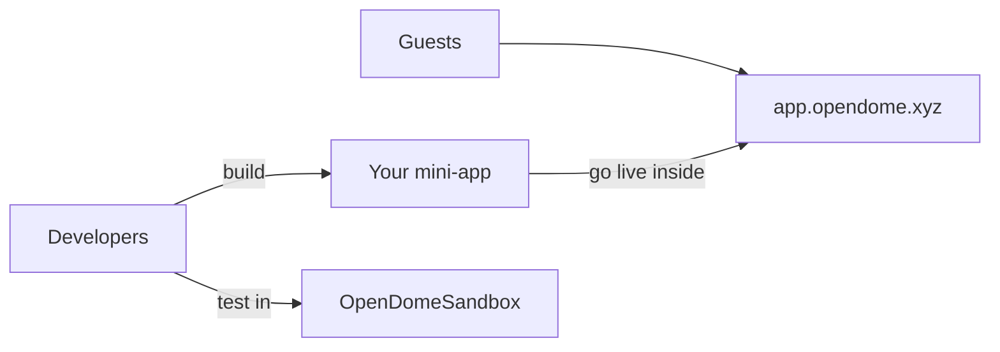
```mermaid
flowchart LR
  Guests["Guests"] --> App["app.opendome.xyz"]
  Developers["Developers"] -->|"build"| MiniApps["Your mini-app"]
  Developers -->|"test in"| Sandbox["OpenDomeSandbox"]
  MiniApps -->|"go live inside"| App
```

**Clear path:** developers build a mini-app with `opendome` → test it in Sandbox → ship it so guests open it from App. Developers do **not** modify OpenDomeApp or OpenDomeSandbox.

---

## For guests: one app instead of ten

The guest logs in once with a passkey. Circle wallets are provisioned behind that identity, so the guest can receive USDC, inspect balances, approve a price, and receive the result without managing keys or leaving the app.

- Browse the venue, its halls, exhibits, and events without installing anything new.
- Fund one wallet on EVM or Solana, then pay from the network that already has USDC.
- Ask the AI concierge to plan an evening. It builds the plan, shows a price, and only continues **after the guest approves**. Nothing charges automatically.
- Receive the answer, transfer confirmation, or scannable pass immediately after settlement.

---

## For developers: build a mini-app, not the host

You do not fork or edit OpenDomeApp / OpenDomeSandbox to add a feature. Those hosts are platform software. Your job is a **mini-app** that docks into them.

| Step | Where | What you do |
| --- | --- | --- |
| 1. Build | Your mini-app repo | Install `opendome` and ship your UI |
| 2. Test | [sandbox.opendome.xyz](https://sandbox.opendome.xyz) | Open your mini-app inside Sandbox and verify docking, session, wallet, and flows |
| 3. Go live | [app.opendome.xyz](https://app.opendome.xyz) | Guests open your mini-app from the real App store |

```bash
npm install opendome
```

```jsx
import { useOpenDome, OpenDomeLockScreen } from 'opendome';

export default function App() {
  const { isAuthorized, isLocked, user, proxiedLocation } = useOpenDome();

  if (isLocked) return <OpenDomeLockScreen />;      // opened outside App/Sandbox
  if (!isAuthorized) return <Text>Connecting…</Text>;

  return <Text>Welcome {user.username}</Text>;       // session came from the host
}
```

That single hook gives you:

| You get | Instead of building |
| --- | --- |
| **Login and user identity** | Your own auth, passwords, and account recovery |
| **Wallet and balances** | Key management, custody, chain integrations |
| **Payments in USDC** | Card processing, merchant accounts, invoicing |
| **Location** | Your own permission prompts and geolocation plumbing |
| **Venue events and places** | Scraping or re-entering the venue catalog |
| **Realtime messaging** | Running your own websocket or broker |

**Your credentials never ship to the browser.** Your mini-app server holds one long-lived token; the host hands back a short-lived session for the browser.

**Host selection is automatic.** Local default docks to App on `:8082`. On Vercel it docks to [app.opendome.xyz](https://app.opendome.xyz). Point at Sandbox only when you are testing (`OPENDOME_DOCKING_HOST_URL` → [sandbox.opendome.xyz](https://sandbox.opendome.xyz)). Guests still only use App.

<p align="center">
  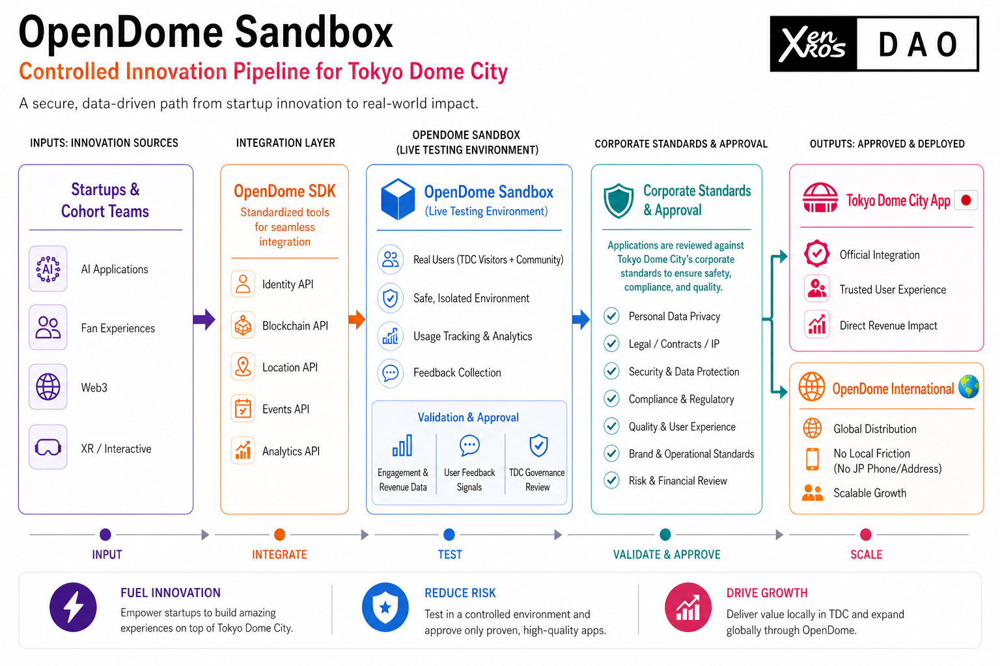
</p>

---

## For the venue: why this is hard to do otherwise

| Problem | Why it blocks the business |
| --- | --- |
| **You cannot simply trust tenant apps** | An outside app running inside yours could read sessions, tokens, and location if the boundary is weak. |
| **Money does not move per interaction** | Card rails cannot economically settle a $0.001 AI answer or a single pass, so everything collapses into slow manual invoicing. |
| **Operations need people at every step** | Planning a guest's day, quoting it, charging it, and issuing the pass is human labor per guest. |

Open-Dome answers each one: a docking handshake that proves who a mini-app is, USDC settlement per interaction through Circle, and a Gemini agent that runs plan → quote → charge → fulfill in production.

---

## How it fits together

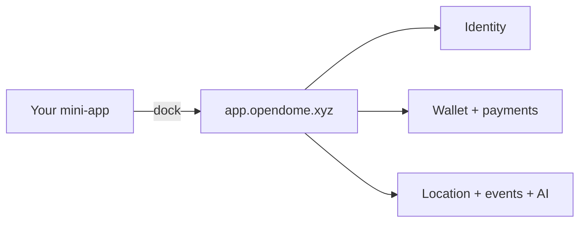
```mermaid
flowchart LR
  MiniApp["Your mini-app"] -->|"dock"| App["app.opendome.xyz"]
  App --> Identity["Identity"]
  App --> Wallet["Wallet + payments"]
  App --> Services["Location + events + AI"]
```

Sandbox is the same docking idea for developers. Guests only ever land on App.

---

## AI-native operations

The agent is not a chat widget bolted onto a catalog. It executes the revenue loop: it decides what to propose, prices it, triggers settlement, and the platform fulfills.

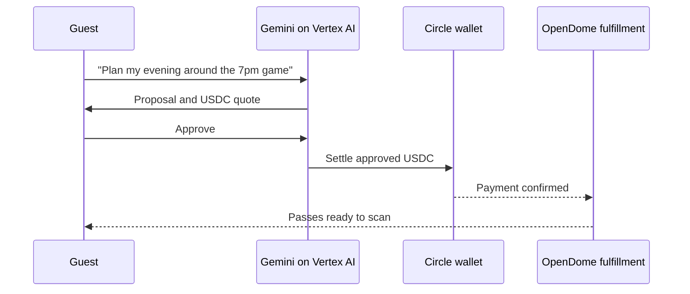
```mermaid
sequenceDiagram
  participant Guest
  participant Agent as Gemini on Vertex AI
  participant Wallet as Circle wallet
  participant Platform as OpenDome fulfillment

  Guest->>Agent: "Plan my evening around the 7pm game"
  Agent->>Guest: Proposal and USDC quote
  Guest->>Agent: Approve
  Agent->>Wallet: Settle approved USDC
  Wallet-->>Platform: Payment confirmed
  Platform-->>Guest: Passes ready to scan
```

**What the AI decides:** which events match intent, which amenities fit each time slot, the schedule under travel and opening-hour constraints, the price of each answer, and which tools to call to inspect wallets and move funds.

**What humans decide:** Approve once, the agent takes care of the rest.

<p align="center">
  <strong>Dome Agent</strong><br>
  <sub>Gemini turns a guest request into a tool-backed venue conversation</sub><br>
  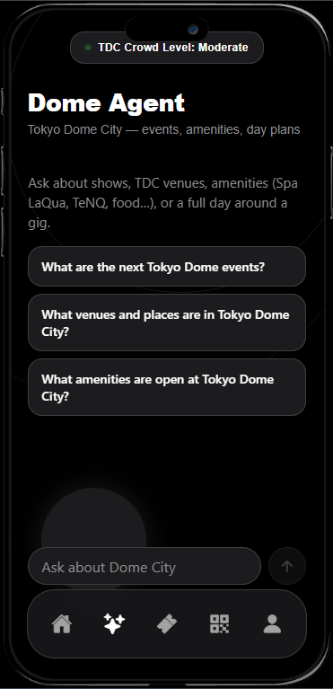
</p>

Two agent layers run in production:

| Layer | Model / method | Role |
| --- | --- | --- |
| **Day-planner council** | Deterministic multi-agent scoring in the SDK | Scout, schedule, and critique itineraries with no LLM cost or nondeterminism |
| **Host agent** | Gemini on Vertex AI with tool calling | Free-form guest requests, wallet operations, venue consulting |

The council proposes; Gemini negotiates, explains, and executes tools. Splitting them keeps itinerary quality reproducible and keeps LLM spend tied to actual paid turns.

### Where the agentic stack lives

| Piece | Path |
| --- | --- |
| Host Gemini API (modes `dome` / `wallet` / `openagent`) | [`OpenDome/OpenDomeApp/src/app/api/agent+api.js`](./OpenDome/OpenDomeApp/src/app/api/agent+api.js) |
| Tool-calling loop | [`OpenDome/OpenDomeApp/src/utilsAPI/geminiToolLoop.js`](./OpenDome/OpenDomeApp/src/utilsAPI/geminiToolLoop.js) |
| Tool schemas (venue + Circle wallet) | [`open-dome-lib/src/agentSkills.js`](./open-dome-lib/src/agentSkills.js) |
| Circle tool execution | [`OpenDome/OpenDomeApp/src/utilsAPI/circleAgentRuntime.js`](./OpenDome/OpenDomeApp/src/utilsAPI/circleAgentRuntime.js) |
| USDC tariff for paid turns | [`open-dome-lib/src/agentTariff.js`](./open-dome-lib/src/agentTariff.js) |
| OpenAgent mini-app UI | [`OpenDome/OpenDomeMiniApps/OpenAgent/`](./OpenDome/OpenDomeMiniApps/OpenAgent/) |
| Deterministic planner agents | [`open-dome-lib/src/dayPlannerAgents.js`](./open-dome-lib/src/dayPlannerAgents.js) |

---

## Payments: Circle wallets, USDC, and x402

Every priced interaction settles in **USDC**. There is no invoicing step and no card terminal. Circle developer-controlled wallets hold funds; guests approve every spend.

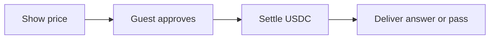
```mermaid
flowchart LR
  Quote["Show price"] --> Approval["Guest approves"]
  Approval --> Payment["Settle USDC"]
  Payment --> Result["Deliver answer or pass"]
```

## Open Dome Facilitator Transactions

The Open Dome Facilitator is officially deployed and actively processing transactions on the Base network. You can verify the address and monitor on-chain activity directly via the block explorer:

**[View on Basescan](https://basescan.org/address/0xd2D5196DbC7a285Fa96d193A91E40F5e4BB39C60)**  
**Address:** `0xd2D5196DbC7a285Fa96d193A91E40F5e4BB39C60`

## Circle Tech Stack:

| Capability | How it works |
| --- | --- |
| **Programmable wallets** | Circle developer-controlled wallets, created per user in wallet sets. Keys never touch the client. |
| **Gasless authorization** | Circle signs EIP-3009 typed data, so the guest authorizes a USDC transfer without holding gas. |
| **x402 metering** | Each agent turn is priced as base tariff plus character length, challenged over HTTP 402, then settled before the model runs. |
| **Multi-network** | Base, Arbitrum, Optimism, Polygon, Avalanche, and Solana USDC. Solana settles through Circle then proves payment. |
| **Cross-chain** | CCTP moves USDC from EVM to Solana when the guest pays on a different network than the treasury holds. |
| **Agent-callable** | Gemini can call wallet tools directly: `list_wallets`, `get_wallet_token_balance`, `estimate_transfer_fee`, `create_transaction`, `create_solana_pay`, `sign_message`. |

A guest can fund the same Circle-backed identity on either family of networks:

<table>
  <tr>
    <td align="center"><strong>Receive</strong><br><sub>EVM address QR</sub><br>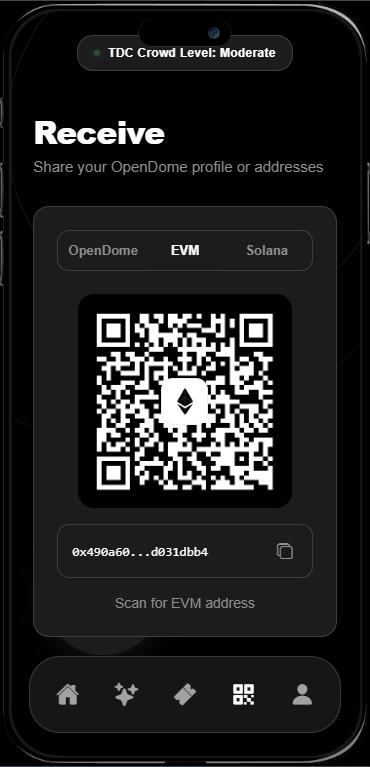</td>
    <td align="center"><strong>Receive</strong><br><sub>Solana address QR</sub><br>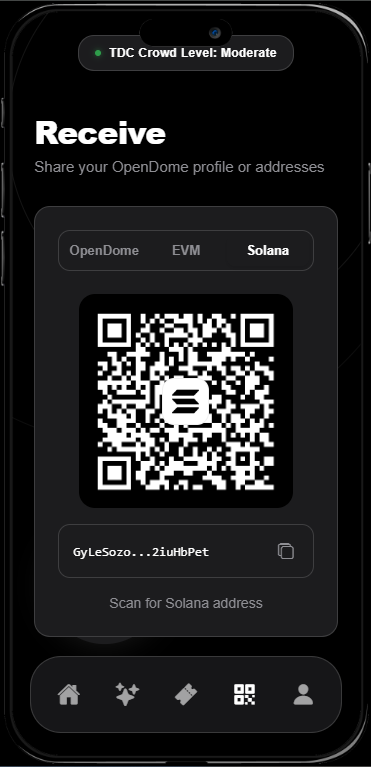</td>
  </tr>
</table>

Gemini reads the wallet through Circle tools, so chain, address, balance, and transaction details come back conversationally rather than forcing the guest into a separate dashboard.

<p align="center">
  <strong>Wallet Agent</strong><br>
  <sub>Gemini inspects the guest's Base wallet through Circle</sub><br>
  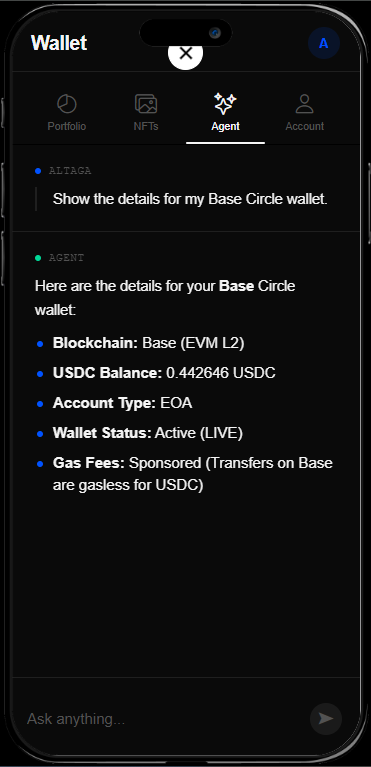
</p>

### Where the Circle / USDC stack lives

| Piece | Path |
| --- | --- |
| Circle client + wallet creation | [`OpenDome/OpenDomeApp/src/utilsAPI/circleTools.js`](./OpenDome/OpenDomeApp/src/utilsAPI/circleTools.js) |
| x402 USDC buyer (EVM + Solana) | [`OpenDome/OpenDomeApp/src/app/api/x402-pay+api.js`](./OpenDome/OpenDomeApp/src/app/api/x402-pay+api.js) |
| Sponsored USDC transfer | [`OpenDome/OpenDomeApp/src/app/api/transfer+api.js`](./OpenDome/OpenDomeApp/src/app/api/transfer+api.js), [`sponsorUsdcTransfer.js`](./OpenDome/OpenDomeApp/src/utilsAPI/sponsorUsdcTransfer.js) |
| Checkout + pass mint after payment | [`checkout+api.js`](./OpenDome/OpenDomeApp/src/app/api/checkout+api.js), [`mint+api.js`](./OpenDome/OpenDomeApp/src/app/api/mint+api.js) |
| Shared x402 / EIP-3009 / USDC chains | [`open-dome-lib/src/x402.js`](./open-dome-lib/src/x402.js), [`eip3009.js`](./open-dome-lib/src/eip3009.js), [`usdcChains.js`](./open-dome-lib/src/usdcChains.js) |
| Guest approval UI | [`TransactionModal.js`](./OpenDome/OpenDomeApp/src/components/TransactionModal.js) |

Example (mini-app → host bridge, guest must approve in the host UI):

```js
import { Host } from 'opendome';

await Host.transfer({
  amount: '1.00',
  destination: '0x…',
  blockchain: 'BASE',
  asset: 'USDC',
});
```

Because settlement is per interaction, the unit economics are visible per guest, per turn, and per pass rather than at month end.

---

## Google Cloud footprint

Google Cloud runs inference, state, and the evidence trail that proves the AI is operating live — and that **USDC settlement** happened.

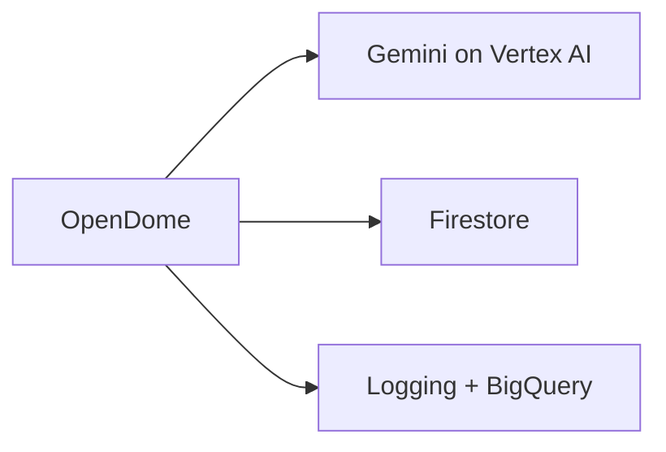
```mermaid
flowchart LR
  OpenDome["OpenDome"] --> Gemini["Gemini on Vertex AI"]
  OpenDome --> Data["Firestore"]
  OpenDome --> Evidence["Logging + BigQuery"]
```

| Service | Use |
| --- | --- |
| **Vertex AI** (`@google/genai`) | Gemini 3.1 Flash-Lite, Gemini 3.6 Flash, and Gemini 3.1 Pro for guest chat, venue consulting, and wallet tool calling. |
| **Cloud Firestore** | Guest identity and roles, Circle wallet references, issued passes and gate tickets, with separate dev and production namespaces. |
| **Cloud Logging** | Two structured streams: `opendome-ai-events` (intent, model, latency, payment network) and `opendome-platform-events` (mints, transfers, checkouts, x402 payments, gate scans). |
| **BigQuery** | Log sink into `ai_agent_logs.opendome_ai_events`, giving a queryable record of every agent decision and settlement for the operations dashboard. |

### Where the Google Cloud stack lives

| Piece | Path |
| --- | --- |
| Vertex Gemini host route | [`OpenDome/OpenDomeApp/src/app/api/agent+api.js`](./OpenDome/OpenDomeApp/src/app/api/agent+api.js) |
| Firestore users / wallets | [`OpenDome/OpenDomeApp/src/utilsAPI/passkeyDb.js`](./OpenDome/OpenDomeApp/src/utilsAPI/passkeyDb.js) |
| AI event logging | [`OpenDome/OpenDomeApp/src/utilsAPI/aiTelemetry.js`](./OpenDome/OpenDomeApp/src/utilsAPI/aiTelemetry.js) |
| Platform / USDC event logging | [`OpenDome/OpenDomeApp/src/utilsAPI/platformTelemetry.js`](./OpenDome/OpenDomeApp/src/utilsAPI/platformTelemetry.js) |
| Ops telemetry API | [`OpenDome/OpenDomeApp/src/app/api/ai-telemetry+api.js`](./OpenDome/OpenDomeApp/src/app/api/ai-telemetry+api.js) |

Guest input is sanitized before logging: emails and wallet addresses are stripped, so the operational record stays useful without retaining personal data.

---

## Zero-trust docking

A tenant mini-app must prove its identity to the host before it gets a session. The host does not trust the embedded app with secrets, and the tenant's long-lived credential never reaches a browser.

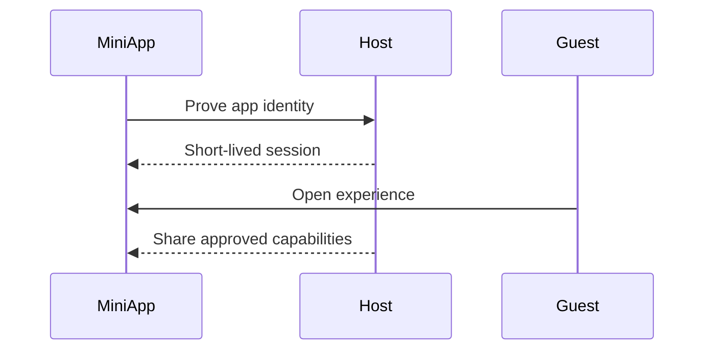
```mermaid
sequenceDiagram
  participant MiniApp
  participant Host
  participant Guest

  MiniApp->>Host: Prove app identity
  Host-->>MiniApp: Short-lived session
  Guest->>MiniApp: Open experience
  Host-->>MiniApp: Share approved capabilities
```

Consequences that matter commercially: a leaked browser token expires in minutes, a compromised tenant cannot impersonate another tenant, and a tenant can be revoked by rotating one host secret. Location is proxied by the host, so tenants get geolocation without triggering their own device permission prompts.

---

## The ecosystem

| Surface | Audience | Role | Live |
| --- | --- | --- | --- |
| **OpenDomeApp** | Guests | Production host: identity, store, payments, agent, minting | [app.opendome.xyz](https://app.opendome.xyz) |
| **OpenDomeSandbox** | Developers | Test host only — never the guest product | [sandbox.opendome.xyz](https://sandbox.opendome.xyz) |
| **Demo** | Reference | Example mini-app for builders | [demo.opendome.xyz](https://demo.opendome.xyz/) |
| **Wallet** | Guests (via App) | USDC and pass wallet mini-app | [wallet.opendome.xyz](https://wallet.opendome.xyz/) |
| **OpenAgent** | Guests (via App) | Pay-per-prompt Gemini chat mini-app | [agent.opendome.xyz](https://agent.opendome.xyz/) |
| **Admin** | Staff (via App) | Issuing and fulfillment mini-app | [admin.opendome.xyz](https://admin.opendome.xyz/) |
| **Scanner** | Staff (via App) | Gate verification mini-app | [scanner.opendome.xyz](https://scanner.opendome.xyz/) |
| **Venue apps** | Guests (via App) | Tokyo Dome, IMM Theater, Korakuen Hall, Gallery AaMo | In-App |

Mini-apps open **from App** for guests (and from Sandbox while you test). Opening a mini-app as a standalone URL leaves it locked—there is no docked session.

---

## Run it locally

**Platform maintainers** (App / Sandbox hosts):

```bash
cd OpenDome/OpenDomeApp && npm install && npm run web       # guests' host → :8082
cd OpenDome/OpenDomeSandbox && npm install && npm run web   # developer test host → :8083
```

**Mini-app developers** (you only change your mini-app):

```bash
cd OpenDome/OpenDomeMiniApps/Demo && npm install && npm run web   # e.g. :8084
```

Open the mini-app from **Sandbox** while testing, or from **App** when validating the guest path. Docking defaults to App (`localhost:8082` / [app.opendome.xyz](https://app.opendome.xyz)); set `OPENDOME_DOCKING_HOST_URL` only to aim at [sandbox.opendome.xyz](https://sandbox.opendome.xyz). Copy `.env.example` and keep real secrets out of git.

Full port map, environment matrix, and protocol rules: [`AGENTS.md`](./AGENTS.md).

---

## Why this works

- The business loop (plan, quote, charge, fulfill, verify at the gate) is executed by agents in production, not simulated in a demo.
- Google Cloud is load-bearing: Vertex AI for inference, Firestore for state, Cloud Logging and BigQuery for the evidence trail.
- Circle turns USDC into a usable product surface: wallets are created for guests, Gemini can inspect them through tools, and every payment has a visible amount, network, and approval step.
- Every tenant that docks is a new revenue surface that costs the venue no additional engineering—the same growth shape as a healthy mini-app ecosystem.

<sub>Built for the [Build with Gemini XPRIZE](https://xprize.devpost.com/).</sub>

---

MIT © Effisend Labs
