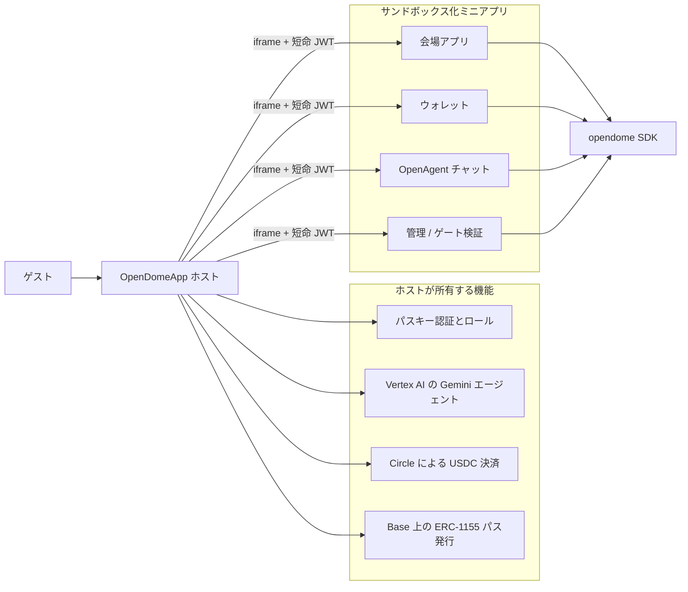
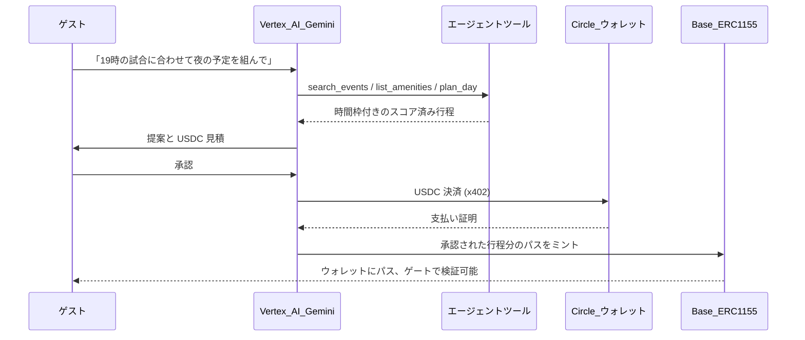
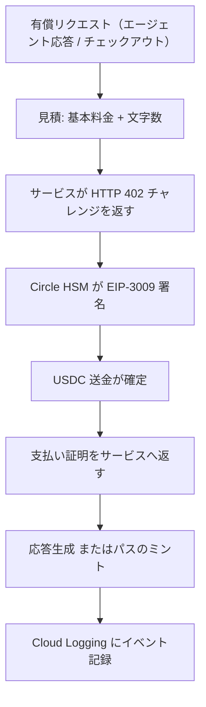
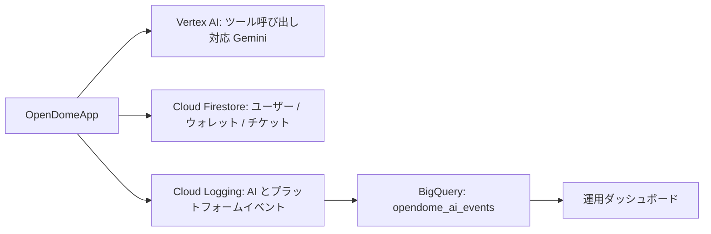
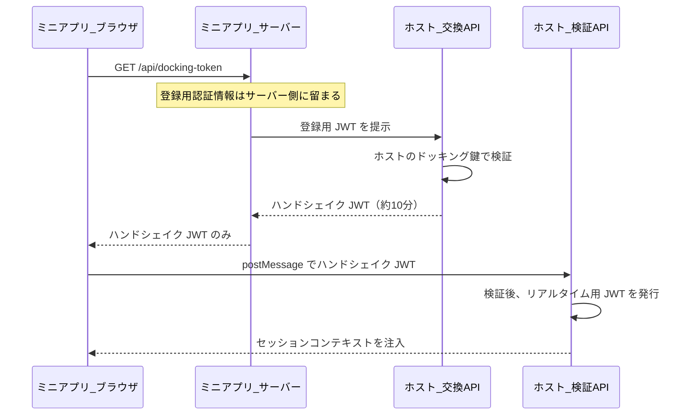

# Open-Dome

### 会場向けスーパーアプリを AI エージェントが運営するためのインフラ

<p align="center">
  
</p>

> **東京ドームシティ** のために構築。入場・体験・時間を販売するあらゆる会場に適用できます。

English: [`README.md`](./README.md) · コーディングエージェント向け機械可読コンテキスト: [`AGENTS.md`](./AGENTS.md)

---

## 解決する課題

東京ドームシティのような会場は、それ自体が一つの経済圏です。スタジアム、コンサートホール、遊園地、ホテル、ギャラリー、飲食店。各テナントは独自のアプリ体験を求め、会場側はゲストとの関係を一元管理したいと考えます。

これをスーパーアプリとして実装しようとすると、3 つの難問に突き当たります。

| 課題 | ビジネス上の障壁 |
| --- | --- |
| **テナントアプリを信頼できない** | 境界設計が弱いと、内部のミニアプリがセッション・トークン・位置情報を読み取れてしまいます。 |
| **インタラクション単位で決済できない** | カード決済では 0.001 ドルのエージェント応答や 1 枚のパスを採算的に処理できず、遅くて手作業の請求に集約されます。 |
| **運用のあらゆる工程に人手が必要** | ゲストごとに、当日の計画・見積・課金・パス発行を人が行うことになります。 |

Open-Dome はこの 3 つを同時に解決します。テナント用ミニアプリのゼロトラスト・ドッキング、Circle による USDC のインタラクション単位決済、そして「計画 → 見積 → 課金 → 履行」のループを本番環境で実行する Gemini エージェントです。

---

## Open-Dome の構成

本番運用中のモノレポで、3 つの要素からなります。

- **ホストアプリ** (`OpenDomeApp`) — ゲスト向けスーパーアプリ本体。ID・決済・ミント・エージェントを所有し、すべての機密情報はここにのみ存在します。
- **ミニアプリ** — テナントおよびスタッフ向け画面（各会場、ウォレット、エージェントチャット、管理、ゲート検証）。サンドボックス化された iframe で動作します。
- **SDK** (`opendome`) — テナントが導入するライブラリ。ホストへのドッキング、セッション、ウォレット、リアルタイム通信、位置情報を提供します。



---

## AI ネイティブな運用

エージェントはカタログに後付けしたチャット機能ではありません。収益ループそのものを実行します。提案内容を判断し、価格を付け、決済を起動し、プラットフォームが履行します。



**AI が判断すること:** 意図に合うイベント、各時間枠に適した施設、移動時間と営業時間を考慮したスケジュール、応答ごとの価格、そしてウォレット参照や送金のために呼び出すツール。

**人が判断すること:** 支払い承認です。自動課金は行いません。

本番では 2 層のエージェントが動作します。

| 層 | モデル / 方式 | 役割 |
| --- | --- | --- |
| **デイプランナー評議会** | SDK 内の決定論的マルチエージェント採点 | LLM コストと非決定性なしに行程を探索・組成・批評 |
| **ホストエージェント** | Vertex AI の Gemini（ツール呼び出し） | 自由入力の要望対応、ウォレット操作、会場コンサルティング |

評議会が提案し、Gemini が説明・調整・ツール実行を担います。分離することで行程品質の再現性を保ち、LLM の費用を実際の課金ターンに紐付けられます。

---

## 決済: Circle ウォレット、USDC、x402

価格が付くすべてのインタラクションは USDC で決済されます。請求処理もカード端末も不要です。



| 機能 | 実装 |
| --- | --- |
| **プログラマブルウォレット** | Circle の developer-controlled wallets をユーザー単位で作成。鍵はクライアントに渡りません。 |
| **ガスレス承認** | Circle が EIP-3009 の署名を行うため、ゲストはガスを保有せずに USDC 送金を承認できます。 |
| **x402 による従量課金** | エージェント応答を「基本料金 + 文字数」で見積り、HTTP 402 でチャレンジし、モデル実行前に決済します。 |
| **マルチネットワーク** | Base、Arbitrum、Optimism、Polygon、Avalanche、Solana の USDC。Solana は Circle 経由で決済し支払いを証明します。 |
| **クロスチェーン** | 支払いネットワークが資金保有先と異なる場合、CCTP で EVM から Solana へ USDC を移動します。 |
| **エージェントから呼び出し可能** | Gemini が `list_wallets`、`get_wallet_token_balance`、`estimate_transfer_fee`、`create_transaction`、`create_solana_pay`、`sign_message` を直接実行します。 |

インタラクション単位で決済するため、ゲスト単位・応答単位・パス単位で採算が可視化されます（月末集計ではありません）。

---

## Google Cloud の利用

Google Cloud が推論・状態管理・「AI が実際に稼働している証跡」を担います。



| サービス | 用途 |
| --- | --- |
| **Vertex AI** (`@google/genai`) | Gemini 3.1 Flash-Lite / 3.6 Flash / 3.1 Pro によるゲスト対応、会場コンサルティング、ウォレットツール実行。 |
| **Cloud Firestore** | ゲスト ID とロール、Circle ウォレット参照、発行済みパスとゲートチケット。開発用と本番用の名前空間を分離。 |
| **Cloud Logging** | 2 系統の構造化ログ: `opendome-ai-events`（意図・モデル・レイテンシ・決済ネットワーク）と `opendome-platform-events`（ミント、送金、チェックアウト、x402 決済、ゲート通過）。 |
| **BigQuery** | `ai_agent_logs.opendome_ai_events` へのログシンク。すべてのエージェント判断と決済を検索可能な記録として保持します。 |

ゲスト入力はログ記録前にサニタイズされ、メールアドレスやウォレットアドレスは除去されます。運用上の有用性を保ちながら個人情報を残しません。

---

## ゼロトラスト・ドッキング

テナントのミニアプリは、自身の正当性をホストに証明する必要があります。ホストは iframe の内容を信頼せず、テナントの長期認証情報はブラウザに渡りません。



事業上の意味は明確です。ブラウザ側のトークンが漏れても数分で失効し、あるテナントが別テナントを偽装できず、ホスト側の 1 つの鍵をローテーションすればテナントを失効させられます。位置情報はホストがプロキシするため、テナントは独自の端末許可ダイアログを出さずに位置情報を利用できます。

---

## エコシステム

| 画面 | 役割 | 公開 URL |
| --- | --- | --- |
| **OpenDomeApp** | 本番ホスト: ID、ストア、決済、エージェント、ミント | [app.opendome.xyz](https://app.opendome.xyz) |
| **OpenDomeSandbox** | テナント開発者向けホストエミュレータ | [sandbox.opendome.xyz](https://sandbox.opendome.xyz) |
| **Demo** | ゲストガイドのリファレンス実装 | [demo.opendome.xyz](https://demo.opendome.xyz/) |
| **Wallet** | USDC とパスのウォレット | [wallet.opendome.xyz](https://wallet.opendome.xyz/) |
| **OpenAgent** | プロンプト従量課金の Gemini チャット | [agent.opendome.xyz](https://agent.opendome.xyz/) |
| **Admin** | スタッフ用の発行・履行 | [admin.opendome.xyz](https://admin.opendome.xyz/) |
| **Scanner** | ゲート検証 | [scanner.opendome.xyz](https://scanner.opendome.xyz/) |
| **会場アプリ** | 東京ドーム、IMM シアター、後楽園ホール、Gallery AaMo | ホスト内 |

ミニアプリは仕様上ホストの iframe 内で動作します。直接開いた場合は検証済みセッションが無いためロック状態になります。

---

## ローカル実行

```bash
# 1. ホスト（機密情報を保持し、ドッキングを検証）
cd OpenDome/OpenDomeApp && npm install && npm run web    # http://localhost:8082

# 2. ミニアプリ
cd OpenDome/OpenDomeMiniApps/Demo && npm install && npm run web   # http://localhost:8084
```

ドッキングを完了させるため、ホストのストアからミニアプリを開いてください。ドッキング先は自動解決されます（開発時は `localhost:8082`、本番は `app.opendome.xyz`）。各アプリの `.env.example` を複製し、実際の機密値は git に含めないでください。

ポート一覧、環境変数マトリクス、プロトコル規則: [`AGENTS.md`](./AGENTS.md)

---

## エージェント経済のために

Open-Dome は **[Build with Gemini XPRIZE](https://xprize.devpost.com/)** への提出プロジェクトであり、*Small Business Services* および *Entrepreneurship & Job Creation* の趣旨に沿っています。会場とテナントが、人員増ではなく AI で運営される仕組みを得ることが狙いです。

- 事業ループ（計画・見積・課金・履行・ゲート検証）を、デモではなく本番でエージェントが実行します。
- Google Cloud が中核です。推論は Vertex AI、状態は Firestore、証跡は Cloud Logging と BigQuery。
- Circle と USDC がインタラクション単位の収益を成立させ、契約交渉なしでテナントを迎えられます。
- ドッキングするテナントが増えるたびに、会場は追加開発なしで収益面を増やせます。

---

MIT © Effisend Labs
