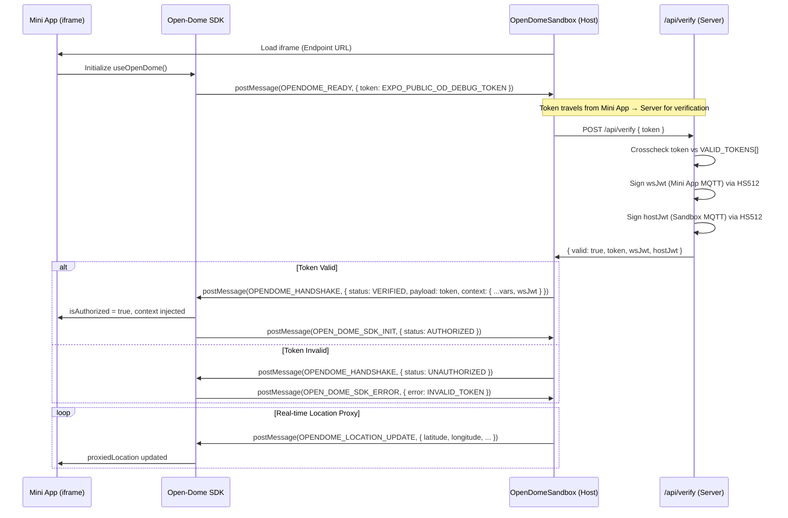
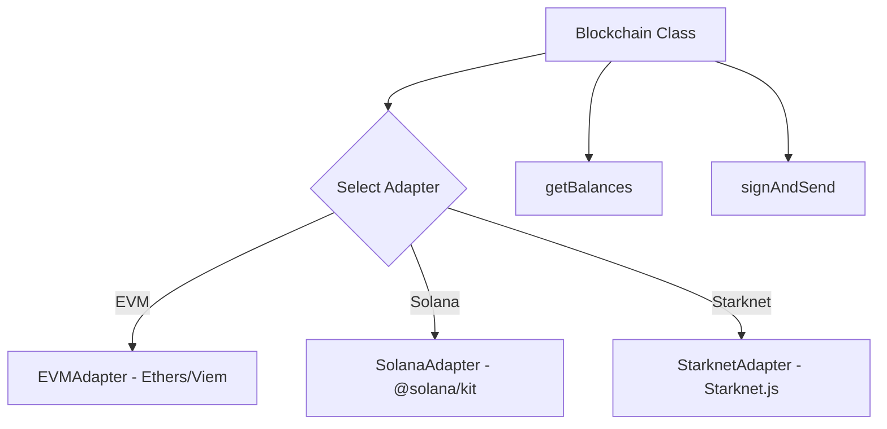
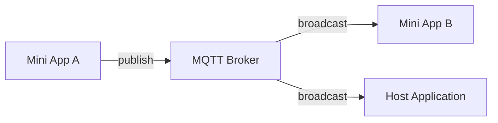
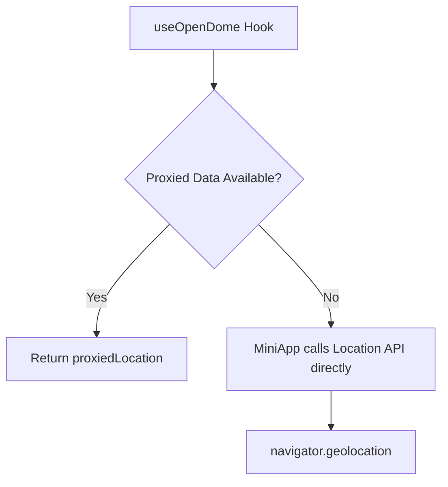
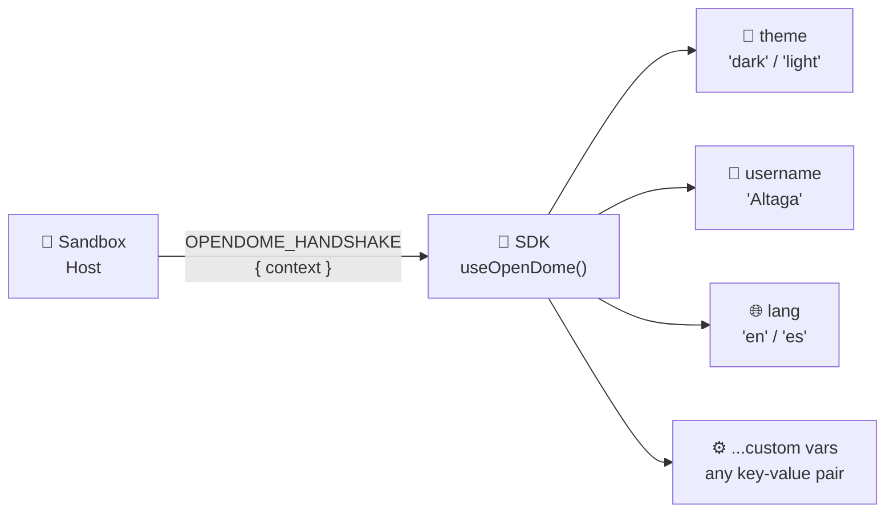
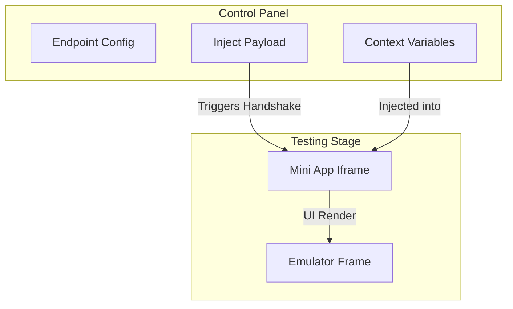
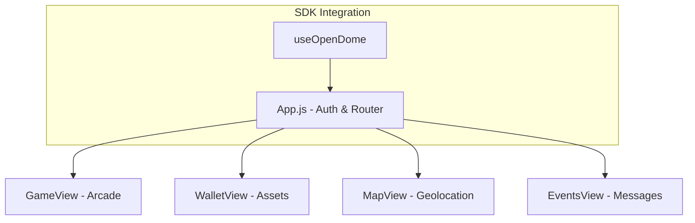

# 🏟️ Open-Dome Ecosystem: The Complete Guide

Welcome to the **Open-Dome** monorepo. This is the comprehensive documentation for building, securing, and testing modular "Mini Apps" within the Effisend ecosystem.

---

## 🚀 Quick Access: Live Demos

Experience the ecosystem in action without any local setup:

- **[🏟️ Open-Dome Visualizer (Sandbox)](https://opendome.expo.app/)**: The official host dashboard for testing Mini-Apps.
- **[📱 Example Mini-App](https://miniapp.expo.app)**: A production-ready reference implementation.
  > [!TIP]
  > Load the Mini-App link inside the Visualizer to see the full handshake and security features in action.

---

## 🏗️ Architecture Overview

The Open-Dome ecosystem is built on three main pillars:

1.  **[🏟️ Open-Dome SDK](./open-dome-lib/)**: The bridge library that handles security, blockchain, and real-time events.
2.  **[🧪 Open-Dome Sandbox](./OpenDomeSandbox/)**: A professional testing laboratory that emulates the host environment.
3.  **[📱 Mini App Example](./MiniApp/)**: A full implementation demonstrating how to build feature-rich modules.

---

## 🔐 1. Security & Handshake (The Foundation)

Open-Dome uses a zero-trust **"Docking" strategy**. The Mini App proves its identity to the Host — not the other way around. The Host never trusts a token it generated itself; it validates the token the Mini App presents against a server-side allowlist.

### The Handshake Protocol



> [!IMPORTANT]
> The token verification happens **exclusively on the server** via the Expo API route `/api/verify`. The raw token list is never exposed to the client bundle. JWTs are generated fresh per session with a 1-day expiry using `HS512`.

### Authentication API
```javascript
const { isAuthorized, token, context, loading } = useOpenDome();
// context includes: username, theme, lang, wsJwt, and any custom variables
// injected by the Host at handshake time
```

---

## 🏟️ 2. Open-Dome SDK: Features & API

The SDK provides enterprise-grade abstractions for the most common needs of modular apps.

### A. Multi-Chain Blockchain
A unified interface for EVM (Base, Monad, etc.), Solana, and Starknet.



**Usage Example:**
```javascript
// Fetch balances across multiple chains at once
const balances = await blockchain.getBalances({
  base: '0x...',
  solana: '...',
  starknet: '0x...'
});
```

### B. Real-time Events (Notice Board)
MQTT-powered pub/sub system for low-latency communication between apps and the host.



**Usage Example:**
```javascript
Events.connect({ jwt: context.wsJwt });
Events.subscribe('opendome/public/events', (data) => console.log(data));
```

### C. Location Proxy
Abstracts geolocation to support both direct access and host-proxied data (mimicking production privacy models).



### D. Context Injection
The Host (Sandbox) injects a key-value context object into the Mini App at handshake time. The Mini App receives it via the `context` field returned by `useOpenDome()` and can use it to adapt its UI, language, or behavior dynamically — without any direct communication with the Host after the handshake.



---

## 🧪 3. Open-Dome Sandbox: The Laboratory

The **Sandbox** (Visualizer) is where you test your app before deployment. It replicates the Effisend Super-App environment.

### Key Capabilities:
- **Mobile Emulator**: Test your app inside a high-fidelity smartphone frame.
- **Context Injection**: Manually change themes (`light`/`dark`), usernames, and languages to see how your app adapts.
- **Security Testing**: Verify how your app handles valid/invalid tokens.
- **Event Monitoring**: Use the **Notice Board** at the bottom to debug real-time MQTT traffic.



---

## � 4. Mini App Example: Implementation Guide

The example project demonstrates how to tie all these features together into a cohesive user experience.

### Architecture:


### Critical Files for Reference:
- **[App.js](./MiniApp/src/App.js)**: Entry point handling the handshake and global theme.
- **[GameView.js](./MiniApp/src/components/GameView.js)**: Arcade game implementation.
- **[WalletView.js](./MiniApp/src/components/WalletView.js)**: Multi-chain balance implementation.
- **[EventsView.js](./MiniApp/src/components/EventsView.js)**: MQTT connection and event board logic.
- **[MapView.js](./MiniApp/src/components/MapView.js)**: Geolocation mapping.

---

MIT © 2026 Effisend Labs
