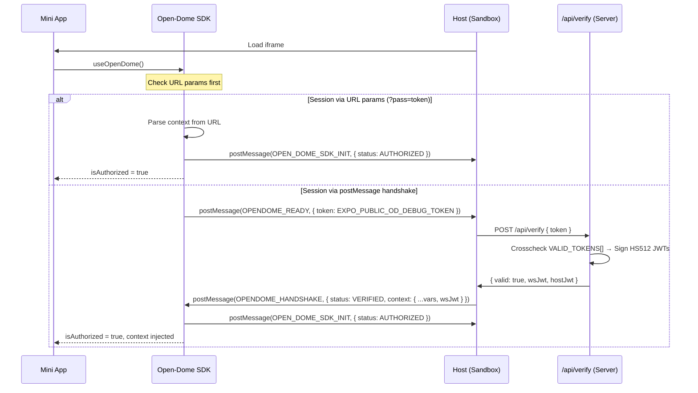
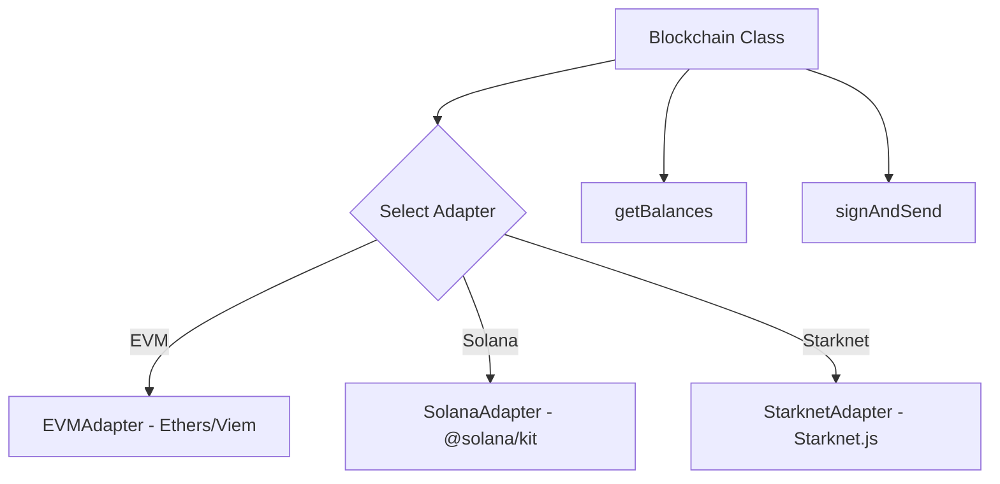
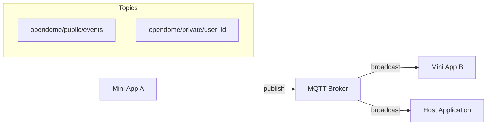
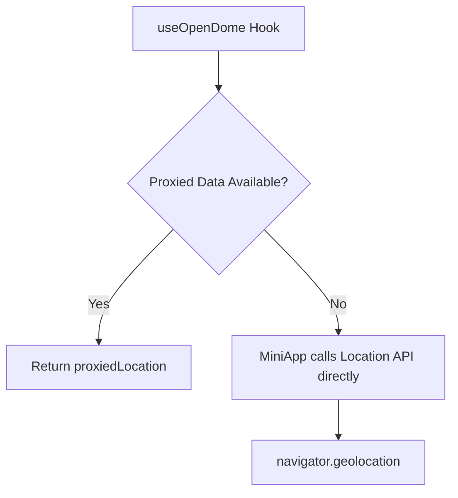

# 🏟️ Open-Dome SDK

Enterprise-grade SDK for secure module integration, multi-chain blockchain interactions, and real-time event distribution within the Effisend Open-Dome ecosystem.

## 🚀 Features & API Usage

### 1. Secure Handshake & Authentication
The `useOpenDome` hook is the entry point for all Mini Apps. It handles the security handshake and provides the execution context. The Mini App sends its own `EXPO_PUBLIC_OD_DEBUG_TOKEN` — the Host verifies it server-side before injecting any context.

**API Reference:**
```javascript
const { 
  isAuthorized, // Boolean: true if session is verified
  token,        // String: Session token
  context,      // Object: { username, theme, lang, wsJwt, ... }
  loading,      // Boolean: true during handshake
  blockchain    // Instance: Access to multi-chain adapters
} = useOpenDome(config);
```

**Sequence Diagram:**


---

### 2. Multi-Chain Blockchain
The `blockchain` object provides a unified interface for multiple networks.

**Architecture:**


**Supported Chains:** `EVM` (Base, Monad, etc.), `Solana`, `Starknet`.

**Usage:**
```javascript
// Fetch balances across multiple chains
const balances = await blockchain.getBalances({
  base: '0x...',
  solana: '...',
  starknet: '0x...'
});

// Single balance
const ethBalance = await blockchain.getBalance('base', '0x...');

// Sign and Send Transaction
const txHash = await blockchain.signAndSend({
  chain: 'base',
  privateKey: '...',
  tx: { to: '0x...', value: '...' }
});
```

---

### 3. Real-time Events (Notice Board)
MQTT-powered pub/sub system for low-latency communication.

**Communication Flow:**


**Usage:**
```javascript
import { Events } from 'opendome';

// Connect using JWT from context
Events.connect({ jwt: context.wsJwt });

// Subscribe to topics
Events.subscribe('opendome/public/events', (data) => {
  console.log('Event received:', data);
});

// Publish events
Events.publish('opendome/public/events', JSON.stringify({
  title: 'System Alert',
  content: 'New user joined'
}));
```

---

### 4. Location Proxy
Abstracts geolocation to support both direct access and host-proxied data.

**Proxy Logic:**


**Usage:**
```javascript
import { Location } from 'opendome';

// Get current position (Proxied automatically if available)
const pos = await Location.getCurrentPosition();

// Watch position
const id = Location.watchPosition((pos) => {
  console.log('Movement detected:', pos);
});
```

## 📦 Installation

```bash
npm install opendome
```

## 📜 License

MIT © Effisend Labs
