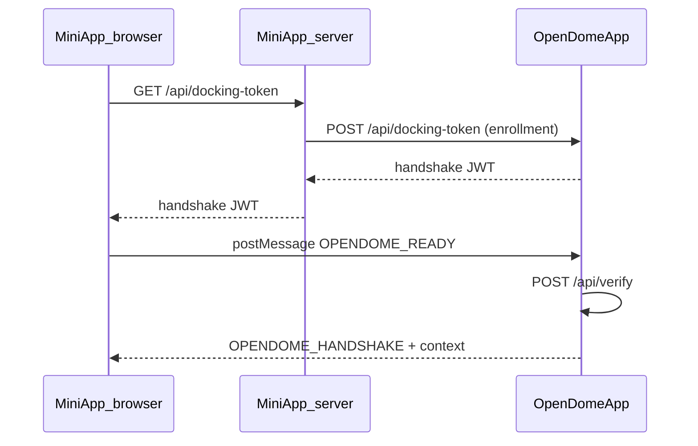

# 🏟️ Open-Dome SDK (`opendome`)

Enterprise SDK for secure mini-app docking, multi-chain Web3, realtime channels, and venue planners inside the Open-Dome Super-App.

**Agents:** read repo-root [`AGENTS.md`](../AGENTS.md) before changing docking, env, or ports.

## Install

```bash
npm install opendome
```

Public package: [`opendome` on npm](https://www.npmjs.com/package/opendome).

In this monorepo, apps keep a local link:

```json
"opendome": "file:../../../open-dome-lib"
```

Server routes should import from `opendome/dist/...` (Babel build). Client hooks can use the package entry.

---

## 1. Docking & `useOpenDome`

Mini-app **server** holds `OD_APP_TOKEN` (enrollment JWT). Browser calls same-origin `GET /api/docking-token`, which exchanges that credential with the host for a ~10-minute handshake JWT. Host verifies with `DOCKING_JWT_TOKEN`.

```javascript
import { useOpenDome } from 'opendome';

const {
  isAuthorized,
  token,
  context,   // username, theme, lang, wsJwt, ...
  loading,
  blockchain,
} = useOpenDome(config);
```


```mermaid
sequenceDiagram
  participant Mini as MiniApp_browser
  participant API as MiniApp_server
  participant Host as OpenDomeApp

  Mini->>API: GET /api/docking-token
  API->>Host: POST /api/docking-token (enrollment)
  Host-->>API: handshake JWT
  API-->>Mini: handshake JWT
  Mini->>Host: postMessage OPENDOME_READY
  Host->>Host: POST /api/verify
  Host-->>Mini: OPENDOME_HANDSHAKE + context
```

### Auto host URL

[`src/dockingHost.js`](./src/dockingHost.js) — used by every mini-app `docking-token` route:

| Condition | Host |
| --- | --- |
| `OPENDOME_DOCKING_HOST_URL` set | That URL |
| Vercel deploy | `https://app.opendome.xyz` |
| Local | `http://localhost:8082` |

Local Expo ports are listed in `LOCAL_EXPO_PORTS` (App `8082` … TokyoDome `8092`).

**Never** put `OD_APP_TOKEN` or `DOCKING_JWT_TOKEN` in `EXPO_PUBLIC_*` / `app.config` `extra`.

---

## 2. Multi-chain blockchain

```javascript
const balances = await blockchain.getBalances({
  base: '0x...',
  solana: '...',
  starknet: '0x...',
});
```

Adapters: EVM (ethers/viem), Solana (`@solana/kit`), Starknet.

---

## 3. Realtime (`Communication`)

MQTT over the `wsJwt` from handshake context:

```javascript
import { Communication } from 'opendome';

Communication.connect({ jwt: context.wsJwt });
Communication.subscribe('opendome/public/events', handler);
```

Venue catalog queries live on `Events` (local JSON helpers), separate from the MQTT bus.

---

## 4. Location proxy

Prefer host-proxied GPS from the handshake / `OPENDOME_LOCATION_UPDATE`. Fall back to `navigator.geolocation` when standalone.

---

## 5. Day planner council

Deterministic multi-agent itinerary (no Gemini):

```javascript
import { buildItineraryProposal } from 'opendome';

const proposal = await buildItineraryProposal({
  event,
  amenities,
  agentCount: 4,
  intent: 'spa',
});
```

Host `/api/agent` is the separate paid Gemini + x402 path.

---

## Build

```bash
cd open-dome-lib
npm run build   # babel src → dist
```

## License

MIT © Effisend Labs
